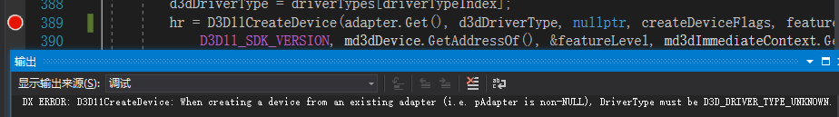

# DirectX11 With Windows SDK

## 前言 

从第一次接触DirectX 11到现在已经有将近三年的时间了。记得当初学习DirectX 11，在用龙书的源码配置项目运行环境的时候都花了好几天的时间才搞定，又因为书中的代码的开发环境(VS 2010)与现在的情况有些冲突，还得忍受上千个无法避免的编译警告，不得不视警告为无物。而且里面的代码使用了Microsoft DirectX SDK(June 2010)开发包和里面的Effects 11框架，这些东西都已经是将近10年前的产物了。

后面到18年5月的时候，我先是在Github上翻到了微软对[FX11(原Effects11)](https://github.com/Microsoft/FX11)库一直都还在更新，然后发现了[DirectX Tool Kit](https://github.com/Microsoft/DirectXTK)和[DirectX SDK Samples](https://github.com/walbourn/directx-sdk-samples)，里面提供的教程写法和龙书的做法不一样。我才明白，微软其实已经将DirectX的相关组件随同Windows SDK一起更新。而我现在使用的是Visual Studio 2019 Community，里面就已经包含了Windows SDK。经过一段时间的文档和样例阅读后，决定尝试编写一个全新的教程尽可能地摆脱DirectX SDK的束缚。

**但是在转移的时候也遇到了很多需要解决的问题，比如:**

1. 没有了诸如`d3dx11.h`, `xnamath.h`, `dxerr.h`, `xnacollision.h`等这些老旧的头文件
2. 使用新的Effects 11框架的话引发编译器警告：`X4717: Effects deprecated for D3DCompiler_47`，提示Effects11未来可能不受D3DCompiler的支持
3. 着色器需要手工进行管理，并且HLSL的写法上和FX有些差异(比如Sampler不能在HLSL中直接定义)
4. 龙书11的示例代码有关Effects 11的部分基本上还得靠自己重新编写

这些问题都可以下面的教程中找到对应的解决/替代方案，在这里就不一一列举了。

## 知识储备 

**十分重要！由于该文章系列注重的是项目实践，并不是面向零基础的初学者。在学习本教程之前需要：**

1. **熟悉C++及面向对象编程，最好是了解C++11，并且能熟练使用指针、数组等内容**。**熟悉Visual Studio的使用**，有一定的项目开发经验。推荐阅读《C++ Primer》一书。
2. 了解Win32 API，但窗口初始化不是本教程的重点，这部分内容自行了解即可。
3. **对线性代数和3D数学基础有所掌握**，推荐阅读《3D数学基础》一书。本教程只会花有限的篇幅进行讲解。
4. **了解渲染管线基础**，可以阅读过龙书11的第4章到第5章，用过游戏引擎进行开发，又或者是之前学过DirectX9/11 或 OpenGL

## 教程与项目特点 

**本教程与项目的特点如下：**

1. 完全**脱离对DirectX SDK的依赖**，下载项目**编译后即可运行**，并且兼容Win7-Win10平台
2. 使用原生的HLSL编译器，并且**不依赖于FX11(Effects)框架和fx5.0**，虽然对实现细节要求更高了，但能够对底层实现有更加深入的了解
3. 对Direct3D 11的一系列API有较为详细的讲解
4. 代码尽可能地不使用高级C++特性（如模板元），以降低阅读源码带来的难度。并且项目内会有一些编写好的小模块，一定程度上降低代码编写的难度
5. 各个项目都是独立的，没有依赖项，以降低它们的复杂度

**尽管这边提供了大量的学习Demo，但还是鼓励大家边学习边自己编写代码，多动手实践，只有踩过的坑才是你自己的。此外项目并不是以追求极致效率为目的，这些事情还是在能够熟练使用Direct3D API的时候再考虑。**

## 降低学习难度 

**如何让你的DirectX 11学习之路更为平坦？在此我给出几点调试相关的建议：**

1. **时间充裕者优先考虑补足知识储备再来学习DirectX 11**
2. 没学会单步调试、断点调试的一定要先去学会。
3. **在调试程序的时候一定要留意输出窗口(来源为调试)，一些D3D相关的函数运行失败都会在这里有十分详细的反馈。**了解这个可以省去你很多开发的时间，避免不必要的查找，这一点十分重要！
4. **学会使用Visual Studio自带的图形调试器**，这是**必修知识**。一定要能够区分开**普通调试（CPU）**和**图形调试（GPU）**！
5. 善于利用一些函数返回的`HRESULT`类型错误码，可以使用我这边的`DXTrace`库来了解错误码的具体含义，也可以使用DirectX SDK中的`Utilities\bin\x86\DXErr.exe`来查询

下面是一个尝试使用显示适配器创建D3D设备引发的错误：\
\
\
\

> **注意：**\
> **1. 考虑到现在DXTK库只是用到了它里面的键鼠类和纹理加载，现在已经单独提取出来使用，读者不需要过于关注这部分内容的实现细节。**\
> **2. 现在某些章节会有一些练习题，除了龙书里面有的部分进行挑选外，自己也尝试出了一些题目。但是题目并不会给出答案（大多数实现方法都并不唯一）**\
> **3. 本教程并不能代表Direct3D的方方面面，务必要善于利用下面参考资料中给予的MSDN文档来查询信息，培养自己的文档阅读能力。**\
> **4.如果你只是单纯为了做一款游戏，那么学习使用Unity 3D来开发可能会更适合您。**

## 阅读顺序 

Direct3D 11学起来并不容易。首先从**入门篇**开始，再根据其要求先阅读**前置章节**（一般是杂项篇）。然后是一些难点部分的问题：

1. 第一章要一遍弄懂会比较难，读者可以先略读一遍，然后从第二章开始进入正题，以后在自己有初始化需求的时候再回头看。
2. 一些比较细节的东西，如涉及到需要靠汇编来解释的部分，读者弄不懂可以先直接记住结论后跳过。
3. 尽管博客总体讲述比较详细，但阅读代码的时候从GameApp类开始，然后最好是按自顶向下的方式逐渐深入。

## 项目下载 

**在开始教程之前务必下载一份源码**，教程中的源码不会给全，只是根据实际需要进行展开说明。**同时也希望能进去点个Star支持一下**。

> [**GitHub项目浏览与下载**](https://github.com/MKXJun/DX11-Without-DirectX-SDK)\
> \
> **欢迎加入QQ群: 727623616 可以一起探讨DX11，以及有什么问题也可以在这里汇报。**

[回到顶部](https://www.cnblogs.com/X-Jun/p/9028764.html#\_labelTop)

## 项目概况 

语言:

* C++14/17
* HLSL Shader Model 5.0

目前项目添加了下述代码库或文件：

* [ocornut/imgui](https://github.com/ocornut/imgui)：当前已经为这些项目使用ImGui：第7、10、15、16、17、20、23、30-37章。
* [nothings/stb](https://github.com/nothings/stb)：使用其stb\_image
* [assimp/assimp](https://github.com/assimp/assimp)：模型加载
* [DirectXTex/DDSTextureLoader](https://github.com/Microsoft/DirectXTex/tree/master/DDSTextureLoader)
* [DirectXTex/WICTextureLoader](https://github.com/Microsoft/DirectXTex/tree/master/WICTextureLoader)
* [DirectXTex/ScreenGrab](https://github.com/Microsoft/DirectXTex/tree/master/ScreenGrab)
* [DirectXTK/Mouse(源码上有所修改)](https://github.com/Microsoft/DirectXTK/tree/master/Src)：不能和imgui同时使用
* [DirectXTK/Keyboard(源码上有所修改)](https://github.com/Microsoft/DirectXTK/tree/master/Src)：不能和imgui同时使用\

> **注意：**
>
> 1. **目前教程仅支持VS2017(平台工具集v141)及更高版本！**
> 2. 如果需要使用Direct2D/DWrite，Win7系统需要安装Service Pack 1以及KB2670838补丁，但目前更推荐使用ImGui

**博客和项目维护不易，目前教程和项目仅由作者一人维持，精力有限。如果本系列教程对你有所帮助，希望能够扫码支持一下博主。**

.png>).png>)

## 参考资料 

MSDN文档，同时推荐大家收藏以随时查阅：

[Direct3D 11 Graphics API(Windows SDK)](https://docs.microsoft.com/zh-cn/windows/desktop/api/\_direct3d11/)

[Direct3D 11 Graphics(Windows SDK)](https://docs.microsoft.com/en-us/windows/desktop/direct3d11/atoc-dx-graphics-direct3d-11)

[DXGI API(Windows SDK)](https://docs.microsoft.com/en-us/windows/desktop/api/\_direct3ddxgi/)

[DXGI(Windows SDK)](https://docs.microsoft.com/en-us/windows/desktop/direct3ddxgi/dx-graphics-dxgi)

[DirectXMath](https://docs.microsoft.com/en-us/windows/win32/dxmath/ovw-xnamath-progguide)

[HLSL](https://docs.microsoft.com/zh-cn/windows/desktop/direct3dhlsl/dx-graphics-hlsl)

参考到的一些网站：

[DirectX SDK Samples](https://github.com/walbourn/directx-sdk-samples)

[Rastertek--DX11](http://www.rastertek.com/tutdx11.html)

[DirectX Tool Kit](https://github.com/Microsoft/DirectXTK)

[Windows SDK](https://developer.microsoft.com/zh-cn/windows/downloads/windows-10-sdk)

[DirectXMath](https://github.com/Microsoft/DirectXMath)

[DirectXTex](https://github.com/Microsoft/DirectXTex)

[龙书网站](http://www.d3dcoder.net)

[DXUT](https://github.com/Microsoft/DXUT)

主要参考书籍：

Introduction to 3D Game Programming with DirectX 11

Practical Rendering and Computation with Direct3D 11

Mathematics for 3D Game Programming and Computer Graphics, Third Edition

DirectX12 3D游戏开发实战

Real-Time Rendering 4th

[回到顶部](https://www.cnblogs.com/X-Jun/p/9028764.html#\_labelTop)

## 后记 

这个博客系列断断续续写了快4年的时间，中间经历了太多太多的事情，而且还要准备考研，当然现在也已经上岸了。**现在的初步打算是会继续出下去。**感谢大家对本项目和教程的支持。一开始只是想着告诉人怎么过渡到Windows SDK版的DX，然后初期的代码基本上就是DirectX-SDK-Samples跟龙书的缝合框架。写到后面有什么好的想法还可能要经常回头改代码，当然这些代码只有在自己实现一遍的时候才会感触良深，受益匪浅。再后来就是认识到了更多的dl，也感受到自己还有很多很多不懂的东西。当然，理论上如果你能看完整个博客系列，你就对Direct3D 11的主线知识基本上都了解的差不多了，对于那些比较边缘的知识此时读者应当有能力自己去根据需要来探寻。这里自问自答几个问题：

* 为什么不讲多线程渲染？我认为如果要学多线程渲染的话，还不如留到学DX12的时候学会更好一些。
* 骨骼动画、Assimp、ImGui怎么鸽了？~~最主要的问题是我一直都在克制自己，不给这个系列项目引入第三方的代码，如果引入了势必会对后续的更新带来麻烦。~~自从用了cmake之后，好像配置起来也没那么麻烦了，当然还是会尽量克制一些的。能跟我教程这么久的读者我觉得应该也有能力去自己尝试加入一些外面的东西了吧。

现在要考虑的问题是接下来学什么？下面是一些可以尝试的内容：

* [GAMES101：现代计算机图形学入门（推荐）](https://sites.cs.ucsb.edu/\~lingqi/teaching/games101.html)
* [GAMES202: 高质量实时渲染](https://sites.cs.ucsb.edu/\~lingqi/teaching/games202.html)
* 现代图形库API：DirectX12、Vulkan
* Real Time Rendering 4th
* Ray Tracing in one Week
* Physically Based Rendering 3rd
* [全局光照技术](http://www.thegibook.com)
* 光线追踪技术
* Unity、Unreal引擎
