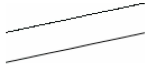
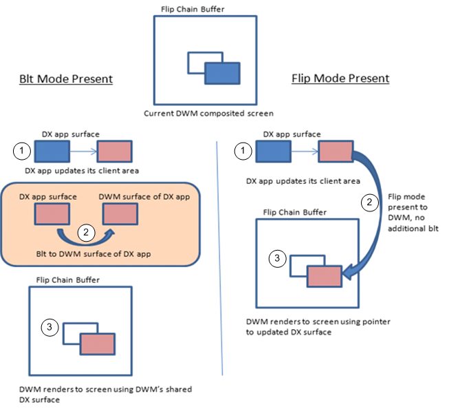
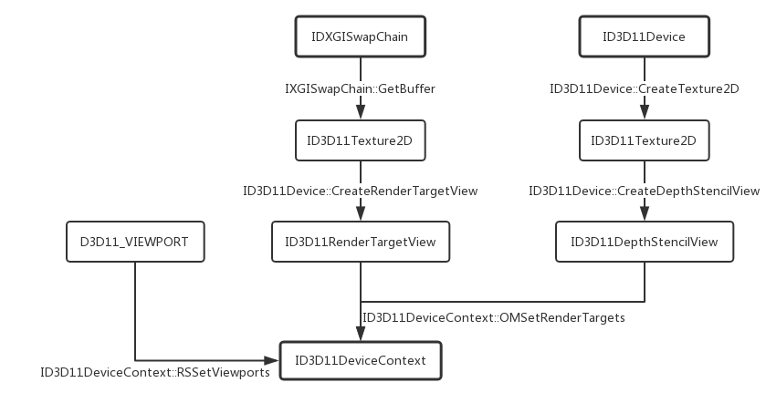
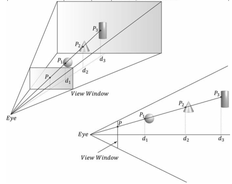
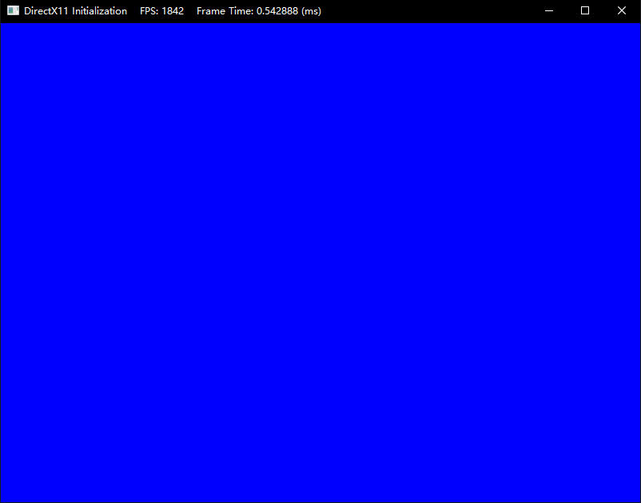
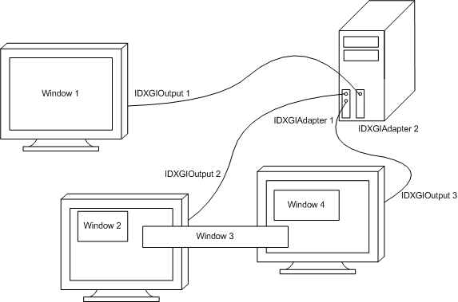

# 前言

由于个人觉得龙书里面第4章提供的Direct3D 初始化项目封装得比较好，而且DirectX SDK Samples里面的初始化程序过于精简，不适合后续使用，故选择了以Init Direct3D项目作为框架，然后还使用了微软提供的示例项目，两者结合到一起。**你需要下载源码后再开始阅读**。

**此外，在阅读本章内容之前，你还需要先浏览下面这些内容**：

| 章节                                       |
| ------------------------------------------ |
| [ComPtr智能指针](../misc/ComPtr.md)        |
| [HR宏关于dxerr库的替代方案](../misc/HR.md) |

这一章内容大部分属于龙书的内容，但仍有一些不同的地方，这些是跟龙书有差异的部分：

1. ComPtr智能指针
2. 新的HR宏
3. D3D11.1设备的创建

**学习目标**：

1. **了解组件对象模型COM与Direct3D 11的联系，以及掌握ComPtr的使用**
2. **掌握基本的图形学概念，如页面翻转、深度缓冲、多重采样**
3. **了解Direct3D设备、设备上下文，以及DXGI交换链的作用**
4. **了解Direct3D 11.x的初始化过程**
5. **了解如何新建Direct3D项目，熟悉当前项目的代码框架**
6. Win32创建窗口和高精度计时器GameTimer的实现按实际需要自行学习，教程不提及

**初始化部分的框架通常比较稳定，而且第一遍看下来可能会有很多不理解的地方。可以先从第二章往后开始入手，看到一定程度后再回头看。**

# 项目结构

现在把目光拉回到我们的教程项目。目前项目中包含头文件的具体功能如下：

| 头文件      | 功能                                                   |
| :---------- | :----------------------------------------------------- |
| d3dApp.h    | Direct3D应用程序框架类                                 |
| d3dUtil.h   | 包含一些常用头文件及自己编写的函数                     |
| DXTrace.h   | 包含了HR宏与`DXTraceW`函数                             |
| GameApp.h   | 游戏应用程序扩展类，游戏逻辑在这里实现，继承自D3DApp类 |
| GameTimer.h | 游戏计时器类                                           |

其中`d3dApp`类和`GameTimer`类是龙书源码提供的，我们可以搬运过来，但是对`d3dApp`框架类我们还需要进行大幅度修改，毕竟我们的最终目的就是要完全脱离旧的DirectX SDK，使用Windows SDK来实现DX11。修改完成后，`d3dApp`就几乎已经定型而不需要我们操心了。

`GameApp`类则是我们编写游戏逻辑的地方，这里需要进行逐帧的更新及绘制。

# D3DApp框架类

`D3DApp.h`展示了框架类的声明，这里的接口类指针全部换上了ComPtr智能指针：

```cpp
class D3DApp
{
public:
    D3DApp(HINSTANCE hInstance);              // 在构造函数的初始化列表应当设置好初始参数
    virtual ~D3DApp();

    HINSTANCE AppInst()const;                 // 获取应用实例的句柄
    HWND      MainWnd()const;                 // 获取主窗口句柄
    float     AspectRatio()const;             // 获取屏幕宽高比

    int Run();                                // 运行程序，进行游戏主循环

                                              // 框架方法。客户派生类需要重载这些方法以实现特定的应用需求
    virtual bool Init();                      // 该父类方法需要初始化窗口和Direct3D部分
    virtual void OnResize();                  // 该父类方法需要在窗口大小变动的时候调用
    virtual void UpdateScene(float dt) = 0;   // 子类需要实现该方法，完成每一帧的更新
    virtual void DrawScene() = 0;             // 子类需要实现该方法，完成每一帧的绘制
    virtual LRESULT MsgProc(HWND hwnd, UINT msg, WPARAM wParam, LPARAM lParam);
    // 窗口的消息回调函数
protected:
    bool InitMainWindow();       // 窗口初始化
    bool InitDirect3D();         // Direct3D初始化

    void CalculateFrameStats();  // 计算每秒帧数并在窗口显示

protected:

    HINSTANCE m_hAppInst;        // 应用实例句柄
    HWND      m_hMainWnd;        // 主窗口句柄
    bool      m_AppPaused;       // 应用是否暂停
    bool      m_Minimized;       // 应用是否最小化
    bool      m_Maximized;       // 应用是否最大化
    bool      m_Resizing;        // 窗口大小是否变化
    bool      m_Enable4xMsaa;    // 是否开启4倍多重采样
    UINT      m_4xMsaaQuality;   // MSAA支持的质量等级


    GameTimer m_Timer;           // 计时器

    // 使用模板别名(C++11)简化类型名
    template <class T>
    using ComPtr = Microsoft::WRL::ComPtr<T>;
    // Direct3D 11
    ComPtr<ID3D11Device> m_pd3dDevice;                    // D3D11设备
    ComPtr<ID3D11DeviceContext> m_pd3dImmediateContext;   // D3D11设备上下文
    ComPtr<IDXGISwapChain> m_pSwapChain;                  // D3D11交换链
    // Direct3D 11.1
    ComPtr<ID3D11Device1> m_pd3dDevice1;                  // D3D11.1设备
    ComPtr<ID3D11DeviceContext1> m_pd3dImmediateContext1; // D3D11.1设备上下文
    ComPtr<IDXGISwapChain1> m_pSwapChain1;                // D3D11.1交换链
    // 常用资源
    ComPtr<ID3D11Texture2D> m_pDepthStencilBuffer;        // 深度模板缓冲区
    ComPtr<ID3D11RenderTargetView> m_pRenderTargetView;   // 渲染目标视图
    ComPtr<ID3D11DepthStencilView> m_pDepthStencilView;   // 深度模板视图
    D3D11_VIEWPORT m_ScreenViewport;                      // 视口

    // 派生类应该在构造函数设置好这些自定义的初始参数
    std::wstring m_MainWndCaption;                        // 主窗口标题
    int m_ClientWidth;                                    // 视口宽度
    int m_ClientHeight;                                   // 视口高度
};

```

而在`d3dApp.cpp`中，可以看到有一个全局变量`g_pd3dApp`：

```cpp
namespace
{
    // This is just used to forward Windows messages from a global window
    // procedure to our member function window procedure because we cannot
    // assign a member function to WNDCLASS::lpfnWndProc.
    D3DApp* g_pd3dApp = 0;
}
```

设置该全局变量是因为在窗口创建的时候需要绑定一个回调函数，受到回调函数指针类型的限制，我们不可以绑定`d3dApp::MainWndProc`的成员方法，所以还需要实现一个全局函数用于回调函数的绑定：

```cpp
LRESULT CALLBACK
MainWndProc(HWND hwnd, UINT msg, WPARAM wParam, LPARAM lParam)
{
    // Forward hwnd on because we can get messages (e.g., WM_CREATE)
    // before CreateWindow returns, and thus before m_hMainWnd is valid.
    return g_pd3dApp->MsgProc(hwnd, msg, wParam, lParam);
}
```

**`D3DApp::InitWindow`和`D3DApp::MsgProc`涉及到Win32 初始化的方法目前在这里不做过多描述，因为这不是教程的重点部分，但后续可能还要回头修改这两个方法。有兴趣的可以去MSDN查阅这些函数和结构体的信息。**

# Direct3D初始化

注意当前项目使用的是`d3d11_1.h`头文件

Direct3D初始化阶段首先需要创建**D3D设备**和**D3D设备上下文**

**D3D设备（`ID3D11Device`）**通常代表一个显示适配器（即显卡），它最主要的功能是用于创建各种所需资源，最常用的资源有：**资源类（ID3D11Resource, 包含纹理和缓冲区）**，**视图类**以及**着色器**。此外，D3D设备还能够用于检测系统环境对功能的支持情况。

**D3D设备上下文(`ID3D11DeviceContext`)**可以看做是一个渲染管线。通常我们在创建D3D设备的同时也会附赠一个**立即设备上下文**(Immediate Context)。一个D3D设备仅对应一个D3D立即设备上下文，并且只要我们拥有其中一方，就能通过各自的方法获取另一方（即`ID3D11Device::GetImmediateContext`和`ID3D11DeviceContext::GetDevice`）。渲染管线主要负责渲染和计算工作，它需要绑定来自与它关联的D3D设备所创建的各种资源、视图和着色器才能正常运转，除此之外，它还能够负责对资源的直接读写操作。

如果你的系统支持Direct3D 11.1的话，则对应的接口类为：`ID3D11Device1`、`ID3D11DeviceContext1`，它们分别继承自上面的两个接口类，区别在于额外提供了少数新的接口，并且接口方法的实现可能会有所区别。

现在，我们从`D3DApp::InitDirect3D`方法开始，一步步进行分析。

## D3D设备与D3D设备上下文的创建

### D3D11CreateDevice函数--创建D3D设备与D3D设备上下文

创建D3D设备、D3D设备上下文使用如下函数：

```cpp
HRESULT WINAPI D3D11CreateDevice(
    IDXGIAdapter* pAdapter,             // [In_Opt]适配器
    D3D_DRIVER_TYPE DriverType,         // [In]驱动类型
    HMODULE Software,                   // [In_Opt]若上面为D3D_DRIVER_TYPE_SOFTWARE则这里需要提供程序模块
    UINT Flags,                         // [In]使用D3D11_CREATE_DEVICE_FLAG枚举类型
    D3D_FEATURE_LEVEL* pFeatureLevels,  // [In_Opt]若为nullptr则为默认特性等级，否则需要提供特性等级数组
    UINT FeatureLevels,                 // [In]特性等级数组的元素数目
    UINT SDKVersion,                    // [In]SDK版本，默认D3D11_SDK_VERSION
    ID3D11Device** ppDevice,            // [Out_Opt]输出D3D设备
    D3D_FEATURE_LEVEL* pFeatureLevel,   // [Out_Opt]输出当前应用D3D特性等级
    ID3D11DeviceContext** ppImmediateContext ); //[Out_Opt]输出D3D设备上下文
```

1. 关于`pAdapter`(显示适配器)，我们可以将它看做是对显示卡设备的一层封装，通过该参数，我们可以指定需要使用哪个显示卡设备。通常该参数我们设为`nullptr`，这样就可以交由上层驱动来帮我们决定使用哪个显卡，或者在**NVIDIA控制面板**来设置当前程序要使用哪个显卡。如果想要在应用层决定，使用`IDXGIFactory::EnumAdapters`方法可以枚举当前可用的显示卡设备。**在最底下的练习题你将学会如何指定显示卡设备来创建Direct3D 11.x设备**。
2. `DriverType`则指定了驱动类型，不过通常大多数情况都会支持`D3D_DRIVER_TYPE_HARDWARE`，以享受硬件加速带来的效益。现在我们建立一个驱动数组，然后自己通过for循环的方式进行轮询：

```cpp
// 驱动类型数组
D3D_DRIVER_TYPE driverTypes[] =
{
    D3D_DRIVER_TYPE_HARDWARE,       // 硬件驱动
    D3D_DRIVER_TYPE_WARP,           // WARP驱动
    D3D_DRIVER_TYPE_REFERENCE,      // 软件驱动
};
UINT numDriverTypes = ARRAYSIZE(driverTypes);
```

如果`D3D_DRIVER_TYPE_HARDWARE`不支持，则需要自己通过循环的形式再检查`D3D_DRIVER_TYPE_WARP`是否支持。**通常虚拟机环境下是不支持硬件驱动的。**

关于`D3D_DRIVER_TYPE`的详细描述，可以去查阅MSDN官方文档详细了解一下。

3. `Flags`对应的是`D3D11_CREATE_DEVICE_FLAG`枚举值，如果需要D3D设备调试的话(在Debug模式下)，可以指定`D3D11_CREATE_DEVICE_DEBUG`枚举值。指定该值后，可以在出现程序异常的时候观察调试输出窗口的信息。
4. `pFeatureLevels`是一个特性等级数组，通过函数内部进行轮询以检测所支持的特性等级：

```cpp
// 特性等级数组
D3D_FEATURE_LEVEL featureLevels[] =
{
    D3D_FEATURE_LEVEL_11_1,
    D3D_FEATURE_LEVEL_11_0,
};
UINT numFeatureLevels = ARRAYSIZE(featureLevels);
```

**注意：如果你的系统支持Direct3D 11.1的API，却把`pFeatureLevels`设置为`nullptr`，`D3D11CreateDevice`将创建出特性等级为`D3D_FEATURE_LEVEL_11_0`的设备。而如果你的系统不支持Direct3D 11.1的API，`D3D11CreateDevice`会立即停止特性数组的轮询并返回`E_INVALIDARG`。为此，你必须要从`D3D_FEATURE_LEVEL_11_0`或更低特性等级开始轮询。**

**在Win10, Win8.x 或 Win7 SP1且安装了KB2670838补丁的系统都支持Direct3D 11.1的API，而纯Win7系统仅支持Direct3D 11的API**

从上面的描述我们可以得知，**特性等级**和**D3D设备的版本**并不是互相对应的：

**1. 特性等级的支持情况取决于当前使用的显示适配器，只要显示适配器支持某一特性等级，意味着它能够支持该特性等级下的统一功能（如特性等级11.0支持纹理宽高最大为16384，而10.1仅支持纹理宽高最大为8192）**

**2. D3D设备的版本取决于所处的系统（有时候可以打特定的系统补丁来支持高版本的DX，比如让Win7支持DX12的部分）**

[点此可以查看Direct3D特性等级](https://docs.microsoft.com/en-us/windows/win32/direct3d11/overviews-direct3d-11-devices-downlevel-intro)

由于该函数可以创建Direct3D 11.0或更高子版本的D3D设备与设备上下文，但都统一输出`ID3D11Device`和`ID3D11DeviceContext`。如果想要查看是否支持Direct3D 11.1的API，可以使用下面的方式：

```cpp
ComPtr<ID3D11Device1> m_pd3dDevice1;
HRESULT hr = m_pd3dDevice.As(&m_pd3dDevice1);
```

同理，想要查看是否支持Direct3D 11.2的API，则可以这样：

```cpp
ComPtr<ID3D11Device2> m_pd3dDevice2;
HRESULT hr = m_pd3dDevice.As(&m_pd3dDevice2);
```

由于每个电脑的显示卡设备情况有所差异，该教程采用的是默认显示卡（如果你是在笔记本上运行，有可能会用到集成显卡），而不是指定显示卡：

```cpp
HRESULT hr = S_OK;

// 创建D3D设备 和 D3D设备上下文
UINT createDeviceFlags = 0;
#if defined(DEBUG) || defined(_DEBUG)  
createDeviceFlags |= D3D11_CREATE_DEVICE_DEBUG;
#endif
// 驱动类型数组
D3D_DRIVER_TYPE driverTypes[] =
{
    D3D_DRIVER_TYPE_HARDWARE,
    D3D_DRIVER_TYPE_WARP,
    D3D_DRIVER_TYPE_REFERENCE,
};
UINT numDriverTypes = ARRAYSIZE(driverTypes);

// 特性等级数组
D3D_FEATURE_LEVEL featureLevels[] =
{
    D3D_FEATURE_LEVEL_11_1,
    D3D_FEATURE_LEVEL_11_0,
};
UINT numFeatureLevels = ARRAYSIZE(featureLevels);

D3D_FEATURE_LEVEL featureLevel;
D3D_DRIVER_TYPE d3dDriverType;
for (UINT driverTypeIndex = 0; driverTypeIndex < numDriverTypes; driverTypeIndex++)
{
    d3dDriverType = driverTypes[driverTypeIndex];
    hr = D3D11CreateDevice(nullptr, d3dDriverType, nullptr, createDeviceFlags, featureLevels, numFeatureLevels,
        D3D11_SDK_VERSION, m_pd3dDevice.GetAddressOf(), &featureLevel, m_pd3dImmediateContext.GetAddressOf());

    if (hr == E_INVALIDARG)
    {
        // Direct3D 11.0 的API不承认D3D_FEATURE_LEVEL_11_1，所以我们需要尝试特性等级11.0以及以下的版本
        hr = D3D11CreateDevice(nullptr, d3dDriverType, nullptr, createDeviceFlags, &featureLevels[1], numFeatureLevels - 1,
            D3D11_SDK_VERSION, m_pd3dDevice.GetAddressOf(), &featureLevel, m_pd3dImmediateContext.GetAddressOf());
    }

    if (SUCCEEDED(hr))
        break;
}

if (FAILED(hr))
{
    MessageBox(0, L"D3D11CreateDevice Failed.", 0, 0);
    return false;
}

// 检测是否支持特性等级11.0或11.1
if (featureLevel != D3D_FEATURE_LEVEL_11_0 && featureLevel != D3D_FEATURE_LEVEL_11_1)
{
    MessageBox(0, L"Direct3D Feature Level 11 unsupported.", 0, 0);
    return false;
}

// 检测 MSAA支持的质量等级
m_pd3dDevice->CheckMultisampleQualityLevels(
    DXGI_FORMAT_R8G8B8A8_UNORM, 4, &m_4xMsaaQuality);
assert(m_4xMsaaQuality > 0);
```

> 注意：
>
> 1. 支持特性等级`11_0`的显示适配器必然支持所有渲染目标纹理格式的4倍多重采样
> 2. 即便`m_4xMsaaQuality`的返回值为1，也不一定就是没法启动4倍多重采样，该成员只是代表模式的种类数目

# DXGI初始化

## 多重采样

由于屏幕中显示的像素不可能是无穷小的，所以并不是任意一条直线都能在显示器上“平滑”而完美地呈现出来。如下图所示的上一条直线，因为它的每个像素的宽高较大，显示出来的直线会有明显的锯齿感。因此我们说这条直线是**走样**的。



虽然说提高像素的分辨率能够缩小像素的大小，但还有一种办法，就是采用各种**反走样（antialiasing）**技术。

例如，超采样技术使用4倍（宽度x2，高度x2）于屏幕分辨率大小的后备缓冲区和深度缓冲区。当数据局要从后备缓冲区调往屏幕显示的时候，会将后备缓冲区按4个像素一组进行**解析**（**resolve**，或称**降采样**，**downsample**）。通过求平均值的方法，把放大的采样点数降低回原采样点数来得到一种相对平滑的像素颜色。超采样不仅需要原来4倍的内存空间，还需要4倍的绘制开销和额外的解析开销，用空间和时间来换取画面的分辨率。

而Direct3D还支持一种在性能和效果等方面都较为折中的反走样技术，即**多重采样（multisample，或MSAA，全称MultiSample Anti-Aliasing）**技术。现在假设我们使用4X多重采样（原来的1个像素对应现在的2x2像素），则他同样使用4倍于游戏分辨率的后备缓冲区和深度缓冲区（注意我们在创建后备缓冲区的时候是指定分辨率而不是指定缓冲区宽高）。跟上面那种方法不同，对每个2x2像素，我们是对这四个像素的中心位置仅采样一次，然后再对这4个像素基于可视性（深度/模板测试）和覆盖性（这些子像素的中心是否在多边形的里面）来决定是否把采样的颜色赋值给它。最后的解析行为则和超采样的一致。这种做法节省了绘制开销，虽然精准度没上面的高，但也能取得比较不错的效果。

## 页面翻转

为了避免动画中出现画面闪烁的现象，最好将动画帧完整地绘制在一种称为后备缓冲区（back buffer）的离屏纹理内。这样观者就不会察觉出帧的绘制过程而只看到完整的动画帧。而前台缓冲区（front buffer）则为当前显示在屏幕上的动画帧，它的构造和前台缓冲区是一样的。通过硬件可以做到，在后备缓冲区的动画帧绘制完成后，通过指针交换的形式，将原来的后备缓冲区变为前台缓冲区，而前台缓冲区则变成下一帧待绘制的后备缓冲区。这种做法避免了内容上的拷贝，有效提升效率。这种翻转操作是在**桌面窗口管理器（DWM）**内实现的。

## DXGI交换链

**DXGI交换链(`IDXGISwapChain`)**缓存了一个或多个表面(2D纹理)，它们都可以称作后备缓冲区(backbuffer)。后备缓冲区则是我们主要进行渲染的场所，我们可以将这些缓冲区通过合适的手段成为渲染管线的输出对象。在进行呈现(Present)的时候有两种方法：

1. **BitBlt Model(位块传输模型)**：将后备缓冲区的数据进行BitBlt(位块传输，即内容上的拷贝)，传入到DWM与DX共享的后备缓冲区，然后进行翻转以显示其内容。使用这种模型至少需要一个后备缓冲区。事实上，这也是Win32应用程序最常使用的方式，在进行呈现后，渲染管线仍然是对同一个后备缓冲区进行输出。（支持Windows 7及更高版本）
2. **Flip Model(翻转模型)**：该模型可以避免上一种方式多余的复制，后备缓冲区表面可以直接与DWM内的前台缓冲区进行翻转。但是需要创建至少两个后备缓冲区，并且在每次完成呈现后通过代码切换到另一个后备缓冲区进行渲染。该模型可以用于Win32应用程序以及UWP应用程序（需要DXGI1.2，支持Windows 8及更高版本）



**注意：考虑到要兼容Win7系统，而且由于我们编写的是Win32应用程序，因此这里使用的是第一种模型。同时这也是绝大多数教程所使用的。对第二种感兴趣的可以了解下面的链接：**

[DXGI翻转模型](https://docs.microsoft.com/zh-cn/windows/desktop/direct3ddxgi/dxgi-flip-model)

**接下来我们需要了解D3D与DXGI各版本的对应关系，这十分重要：**

| Direct3D API支持版本 | 对应包含DXGI版本 | 对应DXGI接口    | 可枚举的显示适配器 | 可创建的交换链    |
| -------------------- | ---------------- | --------------- | ------------------ | ----------------- |
| Direct3D 11.1        | DXGI 1.2         | `IDXGIFactory2` | `IDXGIAdaptor2`    | `IDXGISwapChain1` |
| Direct3D 11.0/10.1   | DXGI 1.1         | `IDXGIFactory1` | `IDXGIAdaptor1`    | `IDXGISwapChain`  |
| Direct3D 10.0        | DXGI 1.0         | `IDXGIFactory`  | `IDXGIAdaptor`     | `IDXGISwapChain`  |

d3d与dxgi版本的对应关系你可以通过观察这些d3d头文件所包含的dxgi头文件来了解。

DXGI交换链的创建需要通过`IDXGIFactory::CreateSwapChain`方法进行。但是，如果是要创建Direct3D 11.1对应的交换链，则需要通过`IDXGIFactory2::CreateSwapChainForHwnd`方法进行。

### 获取IDXGIFactory1或IDXGIFactory2接口类

现在我们需要先拿到包含`IDXGIFactory1`接口的对象，但是为了拿到该对象还需要经历一些磨难。

之前在创建D3D设备时使用的是默认的显卡适配器`IDXGIAdapter`（对于双显卡的笔记本大概率使用的是集成显卡），而创建出来的D3D设备本身实现了`IDXGIDevice`接口，通过该对象，我们可以获取到当前所用的显卡适配器`IDXGIAdapter`对象，这样我们再通过查询它的父级找到是哪个`IDXGIFactory`枚举出来的适配器。

```cpp
ComPtr<IDXGIDevice> dxgiDevice = nullptr;
ComPtr<IDXGIAdapter> dxgiAdapter = nullptr;
ComPtr<IDXGIFactory1> dxgiFactory1 = nullptr;    // D3D11.0(包含DXGI1.1)的接口类
ComPtr<IDXGIFactory2> dxgiFactory2 = nullptr;    // D3D11.1(包含DXGI1.2)特有的接口类

// 为了正确创建 DXGI交换链，首先我们需要获取创建 D3D设备 的 DXGI工厂，否则会引发报错：
// "IDXGIFactory::CreateSwapChain: This function is being called with a device from a different IDXGIFactory."
HR(m_pd3dDevice.As(&dxgiDevice));
HR(dxgiDevice->GetAdapter(dxgiAdapter.GetAddressOf()));
HR(dxgiAdapter->GetParent(__uuidof(IDXGIFactory1), reinterpret_cast<void**>(dxgiFactory1.GetAddressOf())));

// 查看该对象是否包含IDXGIFactory2接口
hr = dxgiFactory1.As(&dxgiFactory2);
// 如果包含，则说明支持D3D11.1
if (dxgiFactory2 != nullptr)
{
    HR(m_pd3dDevice.As(&m_pd3dDevice1));
    HR(m_pd3dImmediateContext.As(&m_pd3dImmediateContext1));
    // ... 省略交换链IDXGISwapChain1的创建
}
else
{
    // ... 省略交换链IDXGISwapChain的创建
}
```

同时之前也提到，如果系统支持Direct3D 11.1的话，我们就可以拿到DXGI 1.2的相关对象（如`IDXGIFactory2`)。

这里要仔细品味`ComPtr::As`方法的作用。该方法相当于调用`IUnknown::QueryInterface`，用于查询这个接口类指针指向的对象是否实现了某个特定接口(即有没有继承，但这个继承不一定是直接继承关系，还可以是间接继承)，若有则返回这个特定接口的指针。比如说`IDXGIFactory2`继承自`IDXGIFactory1`，此时我们有了一个`IDXGIFactory1*`，但我们不知道它能不能转换成`IDXGIFactory2*`，因此可以用`ComPtr::As`方法来尝试获取，失败了也只不过是返回一个`nullptr`指针。但如果此时你用有一个`IDXGIFactory2*`，你调用`ComPtr::As`来获取`IDXGIFactory1*`则是必然成功的操作。

刚才也说到`ComPtr::As`也可以查询间接继承的接口，比如微软告诉你`ID3D11Device`可以通过`IUnknown::QueryInterface`方法获取`IDXGIDevice`，虽然你从继承关系上看不出来有什么联系，但至少在它的实例类中的某一层关系上肯定是有一个内部类继承了接口类`IDXGIDevice`的。

回归正题，这时`m_pd3dDevice`和`m_pd3dDevice1`其实都指向同一个对象，`m_pd3dImmediateContext`和`m_pd3dImmediateContext1`，`m_pSwapChain`和`m_pSwapChain1`也是一样的，区别在于后者实现了额外的一些接口，以及某些特定操作（后面第八章会讲到）。现阶段本教程只会用到和Direct3D 11.0 的API，因此不管是Direct3D 11.1还是Direct3D 11.0，后续都主要使用`m_pd3dDevice`，`m_pd3dImmediateContext`和`m_pSwapChain`来进行操作。

### IDXGIFactory2::CreateSwapChainForHwnd方法--Direct3D 11.1创建交换链 

如果系统支持Direct3D 11.1的话，需要填充`DXGI_SWAP_CHAIN_DESC1`和`DXGI_SWAP_CHAIN_FULLSCREEN_DESC`这两个结构体：

```cpp
typedef struct DXGI_SWAP_CHAIN_DESC1
{
    UINT Width;                        // 分辨率宽度
    UINT Height;                    // 分辨率高度
    DXGI_FORMAT Format;                // 缓冲区数据格式
    BOOL Stereo;                    // 忽略    
    DXGI_SAMPLE_DESC SampleDesc;    // 采样描述
    DXGI_USAGE BufferUsage;            // 缓冲区用途
    UINT BufferCount;                // 缓冲区数目
    DXGI_SCALING Scaling;            // 忽略
    DXGI_SWAP_EFFECT SwapEffect;    // 交换效果
    DXGI_ALPHA_MODE AlphaMode;        // 忽略
    UINT Flags;                        // 使用DXGI_SWAP_CHAIN_FLAG枚举类型
} DXGI_SWAP_CHAIN_DESC1;

typedef struct DXGI_SAMPLE_DESC
{
    UINT Count;                     // MSAA采样数
    UINT Quality;                   // MSAA质量等级
} DXGI_SAMPLE_DESC;

typedef struct DXGI_SWAP_CHAIN_FULLSCREEN_DESC
{
    DXGI_RATIONAL RefreshRate;                    // 刷新率
    DXGI_MODE_SCANLINE_ORDER ScanlineOrdering;    // 忽略
    DXGI_MODE_SCALING Scaling;                    // 忽略
    BOOL Windowed;                                // 是否窗口化
} DXGI_SWAP_CHAIN_FULLSCREEN_DESC;

typedef struct DXGI_RATIONAL
{
    UINT Numerator;                 // 刷新率分子
    UINT Denominator;               // 刷新率分母
} DXGI_RATIONAL;
```

填充好后，这里使用的创建方法为`IDXGIFactory2::CreateSwapChainForHwnd`：

```cpp
HRESULT IDXGIFactory2::CreateSwapChainForHwnd(
    IUnknown *pDevice,                        // [In]D3D设备
    HWND hWnd,                                // [In]窗口句柄
    const DXGI_SWAP_CHAIN_DESC1 *pDesc,        // [In]交换链描述1
    const DXGI_SWAP_CHAIN_FULLSCREEN_DESC *pFullscreenDesc,    // [In]交换链全屏描述，可选
    IDXGIOutput *pRestrictToOutput,            // [In]忽略
    IDXGISwapChain1 **ppSwapChain);            // [Out]输出交换链对象
```

上面第一个省略的部分代码如下：

```cpp
// 填充各种结构体用以描述交换链
DXGI_SWAP_CHAIN_DESC1 sd;
ZeroMemory(&sd, sizeof(sd));
sd.Width = m_ClientWidth;
sd.Height = m_ClientHeight;
sd.Format = DXGI_FORMAT_R8G8B8A8_UNORM;
// 是否开启4倍多重采样？
if (m_Enable4xMsaa)
{
    sd.SampleDesc.Count = 4;
    sd.SampleDesc.Quality = m_4xMsaaQuality - 1;
}
else
{
    sd.SampleDesc.Count = 1;
    sd.SampleDesc.Quality = 0;
}
sd.BufferUsage = DXGI_USAGE_RENDER_TARGET_OUTPUT;
sd.BufferCount = 1;
sd.SwapEffect = DXGI_SWAP_EFFECT_DISCARD;
sd.Flags = 0;

DXGI_SWAP_CHAIN_FULLSCREEN_DESC fd;
fd.RefreshRate.Numerator = 60;
fd.RefreshRate.Denominator = 1;
fd.Scaling = DXGI_MODE_SCALING_UNSPECIFIED;
fd.ScanlineOrdering = DXGI_MODE_SCANLINE_ORDER_UNSPECIFIED;
fd.Windowed = TRUE;
// 为当前窗口创建交换链
HR(dxgiFactory2->CreateSwapChainForHwnd(m_pd3dDevice.Get(), m_hMainWnd, &sd, &fd, nullptr, m_pSwapChain1.GetAddressOf()));
HR(m_pSwapChain1.As(&m_pSwapChain));
```

后续我们还可以通过该交换链来手动指定是否需要全屏

### IDXGIFactory::CreateSwapChain方法--Direct3D 11创建交换链 

如果是Direct3D 11.0的话，需要先填充`DXGI_SWAP_CHAIN_DESC`结构体：

```cpp
typedef struct DXGI_SWAP_CHAIN_DESC
{
    DXGI_MODE_DESC BufferDesc;      // 缓冲区描述
    DXGI_SAMPLE_DESC SampleDesc;    // 采样描述
    DXGI_USAGE BufferUsage;         // 缓冲区用途
    UINT BufferCount;               // 后备缓冲区数目
    HWND OutputWindow;              // 输出窗口句柄
    BOOL Windowed;                  // 窗口化？
    DXGI_SWAP_EFFECT SwapEffect;    // 交换效果
    UINT Flags;                     // 使用DXGI_SWAP_CHAIN_FLAG枚举类型
}     DXGI_SWAP_CHAIN_DESC;

typedef struct DXGI_SAMPLE_DESC
{
    UINT Count;                     // MSAA采样数
    UINT Quality;                   // MSAA质量等级
} DXGI_SAMPLE_DESC;

typedef struct DXGI_MODE_DESC
{
    UINT Width;                     // 分辨率宽度
    UINT Height;                    // 分辨率高度
    DXGI_RATIONAL RefreshRate;      // 刷新率分数表示法
    DXGI_FORMAT Format;             // 缓冲区数据格式
    DXGI_MODE_SCANLINE_ORDER ScanlineOrdering;  // 忽略
    DXGI_MODE_SCALING Scaling;      // 忽略
} DXGI_MODE_DESC;

typedef struct DXGI_RATIONAL
{
    UINT Numerator;                 // 刷新率分子
    UINT Denominator;               // 刷新率分母
} DXGI_RATIONAL;
```

Direct3D 11.0下使用的创建方法为`IDXGIFactory::CreateSwapChain`：

```cpp
HRESULT IDXGIFactory::CreateSwapChain(
    IUnknown *pDevice,                    // [In]D3D设备
    DXGI_SWAP_CHAIN_DESC *pDesc,        // [In]交换链描述
    IDXGISwapChain **ppSwapChain);      // [Out]输出交换链对象
```

第二个省略的部分代码如下：

```cpp
// 填充DXGI_SWAP_CHAIN_DESC用以描述交换链
DXGI_SWAP_CHAIN_DESC sd;
ZeroMemory(&sd, sizeof(sd));
sd.BufferDesc.Width = m_ClientWidth;
sd.BufferDesc.Height = m_ClientHeight;
sd.BufferDesc.RefreshRate.Numerator = 60;
sd.BufferDesc.RefreshRate.Denominator = 1;
sd.BufferDesc.Format = DXGI_FORMAT_R8G8B8A8_UNORM;
sd.BufferDesc.ScanlineOrdering = DXGI_MODE_SCANLINE_ORDER_UNSPECIFIED;
sd.BufferDesc.Scaling = DXGI_MODE_SCALING_UNSPECIFIED;
// 是否开启4倍多重采样？
if (m_Enable4xMsaa)
{
    sd.SampleDesc.Count = 4;
    sd.SampleDesc.Quality = m_4xMsaaQuality - 1;
}
else
{
    sd.SampleDesc.Count = 1;
    sd.SampleDesc.Quality = 0;
}
sd.BufferUsage = DXGI_USAGE_RENDER_TARGET_OUTPUT;
sd.BufferCount = 1;
sd.OutputWindow = m_hMainWnd;
sd.Windowed = TRUE;
sd.SwapEffect = DXGI_SWAP_EFFECT_DISCARD;
sd.Flags = 0;
HR(dxgiFactory1->CreateSwapChain(m_pd3dDevice.Get(), &sd, m_pSwapChain.GetAddressOf()));
```

### 禁用ALT+ENTER与全屏的关联

默认情况下按ALT+ENTER可以切换成全屏，如果不想要这种操作，可以使用刚才创建的`dxgiFactory1`，按照下面的方式来调用即可：

```cpp
dxgiFactory1->MakeWindowAssociation(mhMainWnd, DXGI_MWA_NO_ALT_ENTER | DXGI_MWA_NO_WINDOW_CHANGES);
```

这样DXGI就不会监听Windows消息队列，并且屏蔽掉了对接收到ALT+ENTER消息的处理。

# DXGI交换链与Direct3D设备的交互

在创建好上述对象后，如果窗口的大小是固定的，则需要经历下面的步骤：

1. 获取交换链后备缓冲区的`ID3D11Texture2D`接口对象
2. 为后备缓冲区创建渲染目标视图`ID3D11RenderTargetView`
3. 通过D3D设备创建一个`ID3D11Texture2D`用作深度/模板缓冲区，要求与后备缓冲区等宽高
4. 创建深度/模板视图`ID3D11DepthStrenilView`，绑定刚才创建的2D纹理
5. 通过D3D设备上下文，在渲染管线的输出合并阶段设置渲染目标
6. 在渲染管线的光栅化阶段设置好渲染的视口区域



接下来需要快速了解一遍上述步骤所需要用到的API。

## 获取交换链的后备缓冲区

由于此前我们创建好的交换链已经包含1个后备缓冲区了，我们可以通过`IDXGISwapChain::GetBuffer`方法直接获取后备缓冲区的`ID3D11Texture2D`接口：

```cpp
HRESULT IDXGISwapChain::GetBuffer( 
    UINT Buffer,        // [In]缓冲区索引号，从0到BufferCount - 1
    REFIID riid,        // [In]缓冲区的接口类型ID
    void **ppSurface);  // [Out]获取到的缓冲区
```

## 为后备缓冲区创建渲染目标视图

**渲染目标视图**用于将渲染管线的运行结果输出给其绑定的资源，很明显它也只能够设置给输出合并阶段。渲染目标视图要求其绑定的资源是允许GPU读写的，因为在作为管线输出时会通过GPU写入数据，并且在以后进行混合操作时还需要在GPU读取该资源。通常渲染目标是一个二维的纹理，但它依旧可能会绑定其余类型的资源。这里不做讨论。

现在我们需要将后备缓冲区绑定到渲染目标视图，使用`ID3D11Device::CreateRenderTargetView`方法来创建：

```cpp
HRESULT ID3D11Device::CreateRenderTargetView( 
    ID3D11Resource *pResource,                      // [In]待绑定到渲染目标视图的资源
    const D3D11_RENDER_TARGET_VIEW_DESC *pDesc,     // [In]忽略
    ID3D11RenderTargetView **ppRTView);             // [Out]获取渲染目标视图
```

现在这里演示了获取后备缓冲区纹理，并绑定到渲染目标视图的过程：

```cpp
// 重设交换链并且重新创建渲染目标视图
ComPtr<ID3D11Texture2D> backBuffer;
HR(m_pSwapChain->GetBuffer(0, __uuidof(ID3D11Texture2D), reinterpret_cast<void**>(backBuffer.GetAddressOf())));
HR(m_pd3dDevice->CreateRenderTargetView(backBuffer.Get(), nullptr, m_pRenderTargetView.GetAddressOf()));
```

## 创建深度/模板缓冲区

在这里我们先简单提一下最常用到的深度缓冲区。而之所以叫深度/模板缓冲区，是因为这个缓冲区可以同时存有深度和模板值，更细节的东西就留到后面的章节将。

**深度缓冲区（depth buffer）**这种纹理资源存储的而非图像数据，而是特定像素的深度信息。深度值的范围通常为0.0到1.0，0.0意味着观察者在视锥体（view frustum）能看到的最近位置，1.0则意味着观察者在视锥体能看到的最远位置。深度缓冲区中的元素与后台缓冲区中的像素是一一对应的。因此深度缓冲区的宽高应和后备缓冲区的分辨率保持一致。

Direct3D中同样采用了一种叫做**深度缓冲**或**z缓冲（通常z坐标反映深度）**的技术。只要使用了深度缓冲，我们就无须关心物体的绘制顺序，因为默认情况下我们只会保留深度值最小的像素。它能够有效处理像铁链这种环环相扣的物体，反之对物体按深度排序的**画家算法**就无法处理了。

如下图所示，无论绘制物体的顺序如何，新像素的深度值和深度缓冲区中对应位置的像素的深度值比较，若更小，则替换深度值和后备缓冲区的像素颜色。因此最终能保留下来的像素必然是圆球P1点处的像素。



### ID3D11Device::CreateTexture2D--创建一个2D纹理

除了渲染目标视图外，我们还需要创建深度/模板缓冲区用于深度测试。深度/模板缓冲区也是一个2D纹理，要求其宽度和高度必须要和窗口宽高保持一致。

通过D3D设备可以新建一个2D纹理，但在此之前我们需要先描述该缓冲区的信息：

```cpp
typedef struct D3D11_TEXTURE2D_DESC
{
    UINT Width;         // 缓冲区宽度
    UINT Height;        // 缓冲区高度
    UINT MipLevels;     // Mip等级
    UINT ArraySize;     // 纹理数组中的纹理数量，默认1
    DXGI_FORMAT Format; // 缓冲区数据格式
    DXGI_SAMPLE_DESC SampleDesc;    // MSAA采样描述
    D3D11_USAGE Usage;  // 数据的CPU/GPU访问权限
    UINT BindFlags;     // 使用D3D11_BIND_FLAG枚举来决定该数据的使用类型
    UINT CPUAccessFlags;    // 使用D3D11_CPU_ACCESS_FLAG枚举来决定CPU访问权限
    UINT MiscFlags;     // 使用D3D11_RESOURCE_MISC_FLAG枚举，这里默认0
}     D3D11_TEXTURE2D_DESC;   

```

由于要填充的内容很多，并且目前只有在初始化环节才用到，因此这部分代码可以先粗略看一下，在后续的章节还会详细讲到。

填充好后，这时我们就可以用方法`ID3D11Device::CreateTexture2D`来创建2D纹理：

```cpp
HRESULT ID3D11Device::CreateTexture2D( 
    const D3D11_TEXTURE2D_DESC *pDesc,          // [In] 2D纹理描述信息
    const D3D11_SUBRESOURCE_DATA *pInitialData, // [In] 用于初始化的资源
    ID3D11Texture2D **ppTexture2D);             // [Out] 获取到的2D纹理
```

下面的代码是关于深度/模板缓冲区创建的完整过程：

```cpp
D3D11_TEXTURE2D_DESC depthStencilDesc;

depthStencilDesc.Width = mClientWidth;
depthStencilDesc.Height = mClientHeight;
depthStencilDesc.MipLevels = 1;
depthStencilDesc.ArraySize = 1;
depthStencilDesc.Format = DXGI_FORMAT_D24_UNORM_S8_UINT;

// 要使用 4X MSAA?
if (mEnable4xMsaa)
{
    depthStencilDesc.SampleDesc.Count = 4;
    depthStencilDesc.SampleDesc.Quality = m_4xMsaaQuality - 1;
}
else
{
    depthStencilDesc.SampleDesc.Count = 1;
    depthStencilDesc.SampleDesc.Quality = 0;
}

depthStencilDesc.Usage = D3D11_USAGE_DEFAULT;
depthStencilDesc.BindFlags = D3D11_BIND_DEPTH_STENCIL;
depthStencilDesc.CPUAccessFlags = 0;
depthStencilDesc.MiscFlags = 0;

HR(m_pd3dDevice->CreateTexture2D(&depthStencilDesc, nullptr, m_pDepthStencilBuffer.GetAddressOf()));
```

## 创建深度/模板视图

有了深度/模板缓冲区后，就可以通过`ID3D11Device::CreateDepthStencilView`方法将创建好的2D纹理绑定到新建的深度/模板视图：

```cpp
HRESULT ID3D11Device::CreateDepthStencilView( 
    ID3D11Resource *pResource,                      // [In] 需要绑定的资源
    const D3D11_DEPTH_STENCIL_VIEW_DESC *pDesc,     // [In] 深度缓冲区描述，这里忽略
    ID3D11DepthStencilView **ppDepthStencilView);   // [Out] 获取到的深度/模板视图
```

演示如下：

```cpp
HR(m_pd3dDevice->CreateDepthStencilView(m_pDepthStencilBuffer.Get(), nullptr, m_pDepthStencilView.GetAddressOf()));
```

## 为渲染管线的输出合并阶段设置渲染目标

`ID3D11DeviceContext::OMSetRenderTargets`方法要求同时提供渲染目标视图和深度/模板视图，不过这时我们都已经准备好了：

```cpp
void ID3D11DeviceContext::OMSetRenderTargets( 
    UINT NumViews,                                      // [In] 视图数目
    ID3D11RenderTargetView *const *ppRenderTargetViews, // [In] 渲染目标视图数组
    ID3D11DepthStencilView *pDepthStencilView) = 0;     // [In] 深度/模板视图
```

因此这里同样也是一句话的事情：

```cpp
m_pd3dImmediateContext->OMSetRenderTargets(1, m_pRenderTargetView.GetAddressOf(), m_pDepthStencilView.Get());
```

## 视口设置

最终我们还需要决定将整个视图输出到窗口特定的范围。我们需要使用`D3D11_VIEWPORT`来设置视口

```cpp
typedef struct D3D11_VIEWPORT
{
    FLOAT TopLeftX;     // 屏幕左上角起始位置X
    FLOAT TopLeftY;     // 屏幕左上角起始位置Y
    FLOAT Width;        // 宽度
    FLOAT Height;       // 高度
    FLOAT MinDepth;     // 最小深度，必须为0.0f
    FLOAT MaxDepth;     // 最大深度，必须为1.0f
}     D3D11_VIEWPORT;
```

`ID3D11DeviceContext::RSSetViewports`方法将设置1个或多个视口：

```cpp
void ID3D11DeviceContext::RSSetViewports(
    UINT  NumViewports,                     // 视口数目
    const D3D11_VIEWPORT *pViewports);      // 视口数组
```

将视图输出到整个屏幕需要按下面的方式进行填充：

```cpp
m_ScreenViewport.TopLeftX = 0;
m_ScreenViewport.TopLeftY = 0;
m_ScreenViewport.Width    = static_cast<float>(mClientWidth);
m_ScreenViewport.Height   = static_cast<float>(mClientHeight);
m_ScreenViewport.MinDepth = 0.0f;
m_ScreenViewport.MaxDepth = 1.0f;

m_pd3dImmediateContext->RSSetViewports(1, &m_ScreenViewport);
```

完成了这六个步骤后，基本的初始化就完成了。但是，如果涉及到窗口大小变化的情况，那么前面提到的后备缓冲区、深度/模板缓冲区、视口都需要重新调整大小。

## D3DApp::OnResize方法

已知深度模板缓冲区和视口都可以直接重新创建一份来进行替换。至于后备缓冲区，我们可以通过`IDXGISwapChain::ResizeBuffers`来重新调整后备缓冲区的分辨率：

```cpp
HRESULT IDXGISwapChain::ResizeBuffers(
  UINT        BufferCount,            // [In]缓冲区数目
  UINT        Width,                // [In]新分辨率宽度
  UINT        Height,                // [In]新分辨率高度
  DXGI_FORMAT NewFormat,            // [In]DXGI格式
  UINT        SwapChainFlags        // [In]忽略
);
```

下面的方法演示了在窗口大小发生改变后，以及初次调用时进行的操作：

```cpp
void D3DApp::OnResize()
{
    assert(m_pd3dImmediateContext);
    assert(m_pd3dDevice);
    assert(m_pSwapChain);

    if (m_pd3dDevice1 != nullptr)
    {
        assert(m_pd3dImmediateContext1);
        assert(m_pd3dDevice1);
        assert(m_pSwapChain1);
    }

    // 释放交换链的相关资源
    m_pRenderTargetView.Reset();
    m_pDepthStencilView.Reset();
    m_pDepthStencilBuffer.Reset();

    // 重设交换链并且重新创建渲染目标视图
    ComPtr<ID3D11Texture2D> backBuffer;
    HR(m_pSwapChain->ResizeBuffers(1, m_ClientWidth, m_ClientHeight, DXGI_FORMAT_R8G8B8A8_UNORM, 0));
    HR(m_pSwapChain->GetBuffer(0, __uuidof(ID3D11Texture2D), reinterpret_cast<void**>(backBuffer.GetAddressOf())));
    HR(m_pd3dDevice->CreateRenderTargetView(backBuffer.Get(), nullptr, m_pRenderTargetView.GetAddressOf()));
    
    
    backBuffer.Reset();


    D3D11_TEXTURE2D_DESC depthStencilDesc;

    depthStencilDesc.Width = m_ClientWidth;
    depthStencilDesc.Height = m_ClientHeight;
    depthStencilDesc.MipLevels = 1;
    depthStencilDesc.ArraySize = 1;
    depthStencilDesc.Format = DXGI_FORMAT_D24_UNORM_S8_UINT;

    // 要使用 4X MSAA? --需要给交换链设置MASS参数
    if (m_Enable4xMsaa)
    {
        depthStencilDesc.SampleDesc.Count = 4;
        depthStencilDesc.SampleDesc.Quality = m_4xMsaaQuality - 1;
    }
    else
    {
        depthStencilDesc.SampleDesc.Count = 1;
        depthStencilDesc.SampleDesc.Quality = 0;
    }
    


    depthStencilDesc.Usage = D3D11_USAGE_DEFAULT;
    depthStencilDesc.BindFlags = D3D11_BIND_DEPTH_STENCIL;
    depthStencilDesc.CPUAccessFlags = 0;
    depthStencilDesc.MiscFlags = 0;

    // 创建深度缓冲区以及深度模板视图
    HR(m_pd3dDevice->CreateTexture2D(&depthStencilDesc, nullptr, m_pDepthStencilBuffer.GetAddressOf()));
    HR(m_pd3dDevice->CreateDepthStencilView(m_pDepthStencilBuffer.Get(), nullptr, m_pDepthStencilView.GetAddressOf()));


    // 将渲染目标视图和深度/模板缓冲区结合到管线
    m_pd3dImmediateContext->OMSetRenderTargets(1, m_pRenderTargetView.GetAddressOf(), m_pDepthStencilView.Get());

    // 设置视口变换
    m_ScreenViewport.TopLeftX = 0;
    m_ScreenViewport.TopLeftY = 0;
    m_ScreenViewport.Width = static_cast<float>(m_ClientWidth);
    m_ScreenViewport.Height = static_cast<float>(m_ClientHeight);
    m_ScreenViewport.MinDepth = 0.0f;
    m_ScreenViewport.MaxDepth = 1.0f;

    m_pd3dImmediateContext->RSSetViewports(1, &m_ScreenViewport);
}
```


在后续的部分，该框架的代码基本上不会有什么太大的变动。因此后面代码的添加主要在`GameApp`类实现。如果现在对上面的一些过程不理解，也是正常的，可以在后续学习到视图相关的知识后再来回看这一整个过程。

# GameApp类

对于一个初始化应用程序来说，目前GameApp类的非常简单：

```cpp
class GameApp : public D3DApp
{
public:
    GameApp(HINSTANCE hInstance);
    ~GameApp();

    bool Init();
    void OnResize();
    void UpdateScene(float dt);
    void DrawScene();
};
```

## GameApp::DrawScene方法--每帧画面的绘制

### ID3D11DeviceContext::ClearRenderTargetView方法--清空需要绘制的缓冲区

在每一帧画面绘制的操作中，我们需要清理一遍渲染目标视图绑定的缓冲区

```cpp
void ID3D11DeviceContext::ClearRenderTargetView(
    ID3D11RenderTargetView *pRenderTargetView,  // [In]渲染目标视图
    const FLOAT  ColorRGBA[4]);                 // [In]指定覆盖颜色
```

这里的颜色值范围都是0.0f到1.0f

比如我们要对后备缓冲区(R8G8B8A8)使用蓝色进行清空，可以这样写：

```cpp
float blue[4] = {0.0f, 0.0f, 1.0f, 1.0f}    // RGBA = (0,0,255,255)
m_pd3dImmediateContext->ClearRenderTargetView(m_pRenderTargetView.Get(), blue);
```

### ID3D11DeviceContext::ClearDepthStencilView方法--清空深度/模板缓冲区

同样在进行渲染之前，我们也要清理一遍深度/模板缓冲区

```cpp
void ID3D11DeviceContext::ClearDepthStencilView(
    ID3D11DepthStencilView *pDepthStencilView,  // [In]深度/模板视图
    UINT ClearFlags,    // [In]D3D11_CLEAR_FLAG枚举
    FLOAT Depth,        // [In]深度
    UINT8 Stencil);     // [In]模板初始值
```

若要清空深度缓冲区，则需要指定`D3D11_CLEAR_DEPTH`，模板缓冲区则是`D3D11_CLEAR_STENCIL`。

每一次清空我们需要将深度值设为1.0f，模板值设为0.0f。其中深度值1.0f表示距离最远处：

```cpp
m_pd3dImmediateContext->ClearDepthStencilView(m_pDepthStencilView.Get(), D3D11_CLEAR_DEPTH | D3D11_CLEAR_STENCIL, 1.0f, 0);
```

### IDXGISwapChain::Present方法--前后备缓冲区交换并呈现

完成一切绘制操作后就可以调用该方法了

```cpp
HRESULT ID3D11DeviceContext::Present( 
    UINT SyncInterval,  // [In]通常为0
    UINT Flags);        // [In]通常为0
```

`GameApp::DrawScene`的实现如下：

```cpp
void GameApp::DrawScene()
{
    assert(m_pd3dImmediateContext);
    assert(m_pSwapChain);
    static float blue[4] = { 0.0f, 0.0f, 1.0f, 1.0f };    // RGBA = (0,0,255,255)
    m_pd3dImmediateContext->ClearRenderTargetView(m_pRenderTargetView.Get(), blue);
    m_pd3dImmediateContext->ClearDepthStencilView(m_pDepthStencilView.Get(), D3D11_CLEAR_DEPTH | D3D11_CLEAR_STENCIL, 1.0f, 0);

    HR(m_pSwapChain->Present(0, 0));
}
```

最终绘制的效果应该如下：



# 程序退出后的清理

因为之前我们用的是智能指针，所以`D3DApp`的析构函数十分简单，只需要通过`ID3D11DeviceContext::ClearState`方法来恢复D3D设备上下文到默认状态，卸下所有绑定的资源即可。剩下的事情就交给COM智能指针完成：

```cpp
D3DApp::~D3DApp()
{
    // 恢复所有默认设定
    if (m_pd3dImmediateContext)
        m_pd3dImmediateContext->ClearState();
}
```

# 练习题

**粗体字为自定义题目，本章练习题可以先不做**

1. **尝试修改项目代码，让窗口内的显示变红。**
2. 某些电脑可能有多于一个的显示适配器(显卡)。首先要通过`CreateDXGIFactory`创建`IDXGIFactory`，然后使用`IDXGIFactory::EnumAdapters`来枚举显示适配器。尝试通过这种方式查看你的电脑有多少个显示适配器(`IDXGIAdapter`)，并察看它们的信息。
3. 一个显示适配器可能关联了多个输出设备(`IDXGIOutput`)，你可以使用`IDXGIAdapter::EnumOutputs`方法来枚举出特定的输出，尝试观察它们的信息。

   
4. 对于给定的像素格式，一个输出设备可以支持许多种显示模式(DXGI_MODE_DESC)，通过它可以看到全屏宽度、高度、刷新率。尝试使用`IDXGIOutput::GetDisplayModeList`方法观察所有支持的模式(传递`DXGI_FORMAT_R8G8B8A8_UNORM`格式进去)。
5. **默认情况下的窗口程序是可以通过ALT+ENTER来进入/退出全屏的。此外，我们可以通过`IDXGISwapChain`来动态设置窗口全屏属性，找到对应的方法并尝试一下。**
6. **现在尝试指定显示适配器来创建D3D设备。通过`CreateDXGIFactory`函数来创建`IDXGIFactory`，通常它会包含接口`IDXGIFactory1`，但有可能它也会包含接口`IDXGIFactory2`。在没有创建D3D设备的情况下，这种方式就可以帮助我们了解是否可以创建出Direct3D 11.1的设备。为了能够指定显示适配器来创建D3D11设备，我们需要将`D3D_DRIVER_TYPE`强行设置为`D3D_DRIVER_TYPE_UNKNOWN`，否则在创建设备的时候会得到如下报错信息：`DX ERROR: D3D11CreateDevice: When creating a device from an existing adapter (i.e. pAdapter is non-NULL), DriverType must be D3D_DRIVER_TYPE_UNKNOWN. [ INITIALIZATION ERROR #3146141: ]`。**
