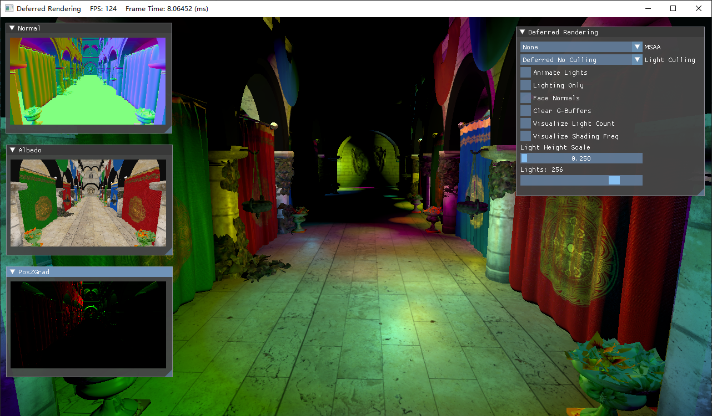
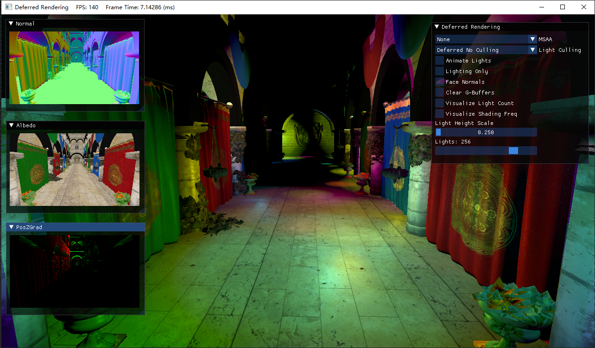

# 前言

[Dear ImGui](https://github.com/ocornut/imgui)是一个开源GUI框架。除了UI部分外，本身还支持简单的键鼠交互。目前项目内置的是V1.87版本，大概半年时间会更新一次版本，并且对源码有小幅度调整。

> 注意：直接下载源码使用会导致19章之后的UI效果有误，修改了源码`imgui_impl_dx11.cpp`，需要用项目源码中的替换下载的。


# 生成ImGui静态库

## 方法一：VS建立项目

在本项目的ImGui文件夹中内置了一个VS项目，你可以参考其做法，也可以直接使用它。具体要用到的头文件和源文件包括这些：


如果你是从网上下载的ImGui包，则需要在根目录、backends里面找出上图这些头文件和源文件。

在将文件夹中列出的.cpp和.h拖入自建的ImGui项目后，进入项目属性页进行改动：


部分内容根据自己VS版本进行修改

然后我们需要生成x64 Debug和x64 Release版本的静态库，生成位置分别位于：

- ImGui/x64/Debug/ImGui.lib
- ImGui/x64/Release/ImGui.lib

然后打开自己之前新建的项目，在属性页中找到C/C++ → 附加包含目录，添加ImGui的目录进你的项目。

紧接着是链接器 → 输入 → 附加依赖项中直接加入ImGui.lib。在Debug和Release下使用统一使用`YourImGuiDir\$(Platform)\$(Configuration)\ImGui.lib`，前面是相对或绝对路径均可。

## 方法二：使用cmake

在ImGui文件夹中已经包含了一个CMakeLists.txt：

```cmake
cmake_minimum_required(VERSION 3.14)

aux_source_directory(. IMGUI_DIR_SRCS)
add_library(ImGui STATIC ${IMGUI_DIR_SRCS})

target_include_directories(ImGui PUBLIC .)
```

你可以将ImGui项目文件夹复制到你的项目路径内，然后在你项目的CMakeList.txt加上这样一句话就可以在你的解决方案中添加并使用ImGui库了：

```cmake
# ImGui
target_link_libraries(YourTargetName ImGui)
```

# 初始化ImGui

在`D3DApp.h`中添加这三个头文件

```cpp
#include <imgui.h>
#include <imgui_impl_dx11.h>
#include <imgui_impl_win32.h>
```

添加`D3DApp::InitImGui`方法：

```cpp
bool D3DApp::InitImGui()
{
    IMGUI_CHECKVERSION();
    ImGui::CreateContext();
    ImGuiIO& io = ImGui::GetIO();
    io.ConfigFlags |= ImGuiConfigFlags_NavEnableKeyboard;     // 允许键盘控制
    io.ConfigWindowsMoveFromTitleBarOnly = true;              // 仅允许标题拖动

    // 设置Dear ImGui风格
    ImGui::StyleColorsDark();

    // 设置平台/渲染器后端
    ImGui_ImplWin32_Init(m_hMainWnd);
    ImGui_ImplDX11_Init(m_pd3dDevice.Get(), m_pd3dImmediateContext.Get());

    return true;

}
```

在`D3DApp::Init`中调用`InitImGui`：

```cpp
bool D3DApp::Init()
{
    if (!InitMainWindow())
        return false;

    if (!InitDirect3D())
        return false;

    if (!InitImGui())
        return false;

    return true;
}
```

然后在`D3DApp.cpp`的上方添加一句话来引用外部函数：

```cpp
extern IMGUI_IMPL_API LRESULT ImGui_ImplWin32_WndProcHandler(HWND hWnd, UINT msg, WPARAM wParam, LPARAM lParam);
```

在消息处理函数`D3DApp::MsgProc`的开头添加ImGui的处理：

```cpp
LRESULT D3DApp::MsgProc(HWND hwnd, UINT msg, WPARAM wParam, LPARAM lParam)
{
    if (ImGui_ImplWin32_WndProcHandler(m_hMainWnd, msg, wParam, lParam))
        return true;
    
    // ...
}
```

在`D3DApp::Run()`中，我们插入这三个函数用于启动ImGui新一帧的记录与绘制：

```cpp
int D3DApp::Run()
{
    MSG msg = { 0 };

    m_Timer.Reset();

    while (msg.message != WM_QUIT)
    {
        if (PeekMessage(&msg, 0, 0, 0, PM_REMOVE))
        {
            TranslateMessage(&msg);
            DispatchMessage(&msg);
        }
        else
        {
            m_Timer.Tick();

            if (!m_AppPaused)
            {
                CalculateFrameStats();
                // 这里添加
                ImGui_ImplDX11_NewFrame();     
                ImGui_ImplWin32_NewFrame();
                ImGui::NewFrame();
                // --------
                UpdateScene(m_Timer.DeltaTime());
                DrawScene();
            }
            else
            {
                Sleep(100);
            }
        }
    }

    return (int)msg.wParam;
}
```

最后就是在`GameApp::DrawScene()`中插入这两句：

```cpp
void GameApp::UpdateScene(float dt)
{
    // 可以在这之前调用ImGui的UI部分
}

void GameApp::DrawScene()
{
    
    // 可以在这之前调用ImGui的UI部分
    // Direct3D 绘制部分
    
    ImGui::Render();
    // 下面这句话会触发ImGui在Direct3D的绘制
    // 因此需要在此之前将后备缓冲区绑定到渲染管线上
    ImGui_ImplDX11_RenderDrawData(ImGui::GetDrawData());

    HR(m_pSwapChain->Present(0, 0));
}
```

这样就完成了ImGui的初始化。接下来可以在`UpdateScene`里面放几个ImGui的实例窗口看看：

```cpp
void GameApp::UpdateScene(float dt)
{
    // ImGui内部示例窗口
    ImGui::ShowAboutWindow();
    ImGui::ShowDemoWindow();
    ImGui::ShowUserGuide();
}
```

出现这些窗口且可以操作的话就是成功了，但是在前面的代码中已经禁用了双击窗口区域折叠的功能。


需要注意的是程序运行后，exe所在的路径会生成一个`imgui.ini`的文件，用于记录窗口的布局，这样下次打开的话就会保持先前的窗口状态。可以在将布局弄好后，把`imgui.ini`复制复制到项目路径，然后通过cmake复制过去：

```cmake
file(COPY imgui.ini DESTINATION ${CMAKE_CURRENT_BINARY_DIR})
```

# 项目窗口实例

通常一个窗口的结构为：

```cpp
static bool is_open = true;
if (ImGui::Begin("Window" /*, &is_open */))  // 窗口右上角加上X关闭
{
    // 添加组件
}
ImGui::end();
```

以本项目的为例：

```cpp
//
// 自定义窗口与操作
//
static float tx = 0.0f, ty = 0.0f, phi = 0.0f, theta = 0.0f, scale = 1.0f, fov = XM_PIDIV2;
static bool animateCube = true, customColor = false;
if (animateCube)
{
    phi += 0.3f * dt, theta += 0.37f * dt;
    phi = XMScalarModAngle(phi);
    theta = XMScalarModAngle(theta);
}

if (ImGui::Begin("Use ImGui"))
{
    ImGui::Checkbox("Animate Cube", &animateCube);   // 复选框
    ImGui::SameLine(0.0f, 25.0f);                    // 下一个控件在同一行往右25像素单位
    if (ImGui::Button("Reset Params"))               // 按钮
    {
        tx = ty = phi = theta = 0.0f;
        scale = 1.0f;
        fov = XM_PIDIV2;
    }
    ImGui::SliderFloat("Scale", &scale, 0.2f, 2.0f);  // 拖动控制物体大小

    ImGui::Text("Phi: %.2f degrees", XMConvertToDegrees(phi));     // 显示文字，用于描述下面的控件 
    ImGui::SliderFloat("##1", &phi, -XM_PI, XM_PI, "");            // 不显示控件标题，但使用##来避免标签重复
                                                 // 空字符串避免显示数字
    ImGui::Text("Theta: %.2f degrees", XMConvertToDegrees(theta));
    // 另一种写法是ImGui::PushID(2);
    // 把里面的##2删去
    ImGui::SliderFloat("##2", &theta, -XM_PI, XM_PI, "");          
    // 然后加上ImGui::PopID(2);
    
    ImGui::Text("Position: (%.1f, %.1f, 0.0)", tx, ty);

    ImGui::Text("FOV: %.2f degrees", XMConvertToDegrees(fov));
    ImGui::SliderFloat("##3", &fov, XM_PIDIV4, XM_PI / 3 * 2, "");

    if (ImGui::Checkbox("Use Custom Color", &customColor))
        m_CBuffer.useCustomColor = customColor;
    // 下面的控件受上面的复选框影响
    if (customColor)
    {
        ImGui::ColorEdit3("Color", reinterpret_cast<float*>(&m_CBuffer.color));  // 编辑颜色
    }
}
ImGui::End();
```

然后就可以得到这样的一个窗口：


为了让立方体显示自己设置的颜色，着色器改为了下面这样：

```hlsl
// Cube.hlsli
cbuffer ConstantBuffer : register(b0)
{
    matrix g_World; // matrix可以用float4x4替代。不加row_major的情况下，矩阵默认为列主矩阵，
    matrix g_View;  // 可以在前面添加row_major表示行主矩阵
    matrix g_Proj;  // 该教程往后将使用默认的列主矩阵，但需要在C++代码端预先将矩阵进行转置。
    vector g_Color;
    uint g_UseCustomColor;
}


struct VertexIn
{
    float3 posL : POSITION;
    float4 color : COLOR;
};

struct VertexOut
{
    float4 posH : SV_POSITION;
    float4 color : COLOR;
};

// Cube_VS.hlsl
VertexOut VS(VertexIn vIn)
{
    VertexOut vOut;
    vOut.posH = mul(float4(vIn.posL, 1.0f), g_World);  // mul 才是矩阵乘法, 运算符*要求操作对象为
    vOut.posH = mul(vOut.posH, g_View);               // 行列数相等的两个矩阵，结果为
    vOut.posH = mul(vOut.posH, g_Proj);               // Cij = Aij * Bij
    vOut.color = vIn.color;                         // 这里alpha通道的值默认为1.0
    return vOut;
}

// Cube_PS.hlsl
// 像素着色器
float4 PS(VertexOut pIn) : SV_Target
{
    return g_UseCustomColor ? g_Color : pIn.color;
}

```

然后常量缓冲区记得更新：

```cpp
m_CBuffer.world = XMMatrixTranspose(
    XMMatrixScalingFromVector(XMVectorReplicate(scale)) * 
    XMMatrixRotationX(phi) * XMMatrixRotationY(theta) * 
    XMMatrixTranslation(tx, ty, 0.0f));
m_CBuffer.proj = XMMatrixTranspose(XMMatrixPerspectiveFovLH(fov, AspectRatio(), 1.0f, 1000.0f));
// 更新常量缓冲区
D3D11_MAPPED_SUBRESOURCE mappedData;
HR(m_pd3dImmediateContext->Map(m_pConstantBuffer.Get(), 0, D3D11_MAP_WRITE_DISCARD, 0, &mappedData));
memcpy_s(mappedData.pData, sizeof(m_CBuffer), &m_CBuffer, sizeof(m_CBuffer));
m_pd3dImmediateContext->Unmap(m_pConstantBuffer.Get(), 0);
```

现在尝试一下效果：


# 利用ImGui的IO事件

通过ImGui本身提供的函数，我们能够获取到一些常用的键鼠事件：

```cpp
ImVec2 pos = ImGui::GetCursorPos();         // 鼠标位置
bool active = ImGui::IsMouseDragging(ImGuiMouseButton_Left);  // 鼠标左键是否在拖动
active = ImGui::IsMouseDown(ImGuiMouseButton_Right);		// 鼠标右键是否处于按下状态
active = ImGui::IsKeyPressed(ImGuiKey_W);   // 是否刚按下W键
active = ImGui::IsKeyReleased(ImGuiKey_S);	// 是否刚松开S键
active = ImGui::IsMouseDoubleClicked(ImGuiMouseButton_Left);  // 是否双击左键
// ...
```

还有一些事件无法通过函数获取的，我们可以使用`ImGuiIO`来获取：

```cpp
ImGuiIO& io = ImGuiIO::GetIO();
auto& delta = io.MouseDelta; // 当前帧鼠标位移量
io.MouseWheel;               // 鼠标滚轮
```

下面展示了利用ImGui的IO事件操作物体：

```cpp
// 不允许在操作UI时操作物体
if (!ImGui::IsAnyItemActive())
{
    // 鼠标左键拖动平移
    if (ImGui::IsMouseDragging(ImGuiMouseButton_Left))
    {
        tx += io.MouseDelta.x * 0.01f;
        ty -= io.MouseDelta.y * 0.01f;
    }
    // 鼠标右键拖动旋转
    else if (ImGui::IsMouseDragging(ImGuiMouseButton_Right))
    {
        phi -= io.MouseDelta.y * 0.01f;
        theta -= io.MouseDelta.x * 0.01f;
    }
    // 鼠标滚轮缩放
    else if (io.MouseWheel != 0.0f)
    {
        scale += 0.02f * io.MouseWheel;
        if (scale > 2.0f)
            scale = 2.0f;
        else if (scale < 0.2f)
            scale = 0.2f;
    }
}
```

现在就可以操作这个立方体了：


至此ImGui就算是入门了。由于ImGui本身是没有文档的，读者需要通过`Dear ImGui Demo`的窗口来寻找自己需要的控件，然后在`imgui_demo.cpp`中搜索对应位置的控件以查看它代码是怎么用的。这里也推荐一个网站方便检索：[ImGui Manual (pthom.github.io)](https://pthom.github.io/imgui_manual_online/manual/imgui_manual.html)

# 后备缓冲区使用sRGB时需要解决的问题(进阶)

初学者可以跳过这一段，在遇到下面UI过亮的情况时候可以回头看。

通常情况下我们使用的渲染目标格式是`DXGI_FORMAT_R8G8B8A8_UNORM`的，而如果是`DXGI_FORMAT_R8G8B8A8_UNORM_SRGB`的话，会导致ImGui过亮，就像下面的图这样：



ImGui本身是对sRGB无动于衷的。根据[sRGB and linear color spaces · Issue #578 · ocornut/imgui](https://github.com/ocornut/imgui/issues/578)，我们可以利用ImGui提供的没有使用到的枚举值`ImGuiConfigFlags_IsSRGB`，然后需要对ImGui的源码做一些修改。

在`imgui_impl_dx11.cpp`大致382行的位置，我们使用如下代码替换`vertexShader`，使得能够根据`ImGuiConfigFlags_IsSRGB`的设置与否来决定是否需要去除伽马校正：

```cpp
static const char* vertexShader = nullptr;
if (ImGui::GetIO().ConfigFlags & ImGuiConfigFlags_IsSRGB)
{
    vertexShader = 
        "cbuffer vertexBuffer : register(b0) \
                {\
                  float4x4 ProjectionMatrix; \
                };\
                struct VS_INPUT\
                {\
                  float2 pos : POSITION;\
                  float4 col : COLOR0;\
                  float2 uv  : TEXCOORD0;\
                };\
                \
                struct PS_INPUT\
                {\
                  float4 pos : SV_POSITION;\
                  float4 col : COLOR0;\
                  float2 uv  : TEXCOORD0;\
                };\
                \
                PS_INPUT main(VS_INPUT input)\
                {\
                  PS_INPUT output;\
                  output.pos = mul( ProjectionMatrix, float4(input.pos.xy, 0.f, 1.f));\
                  output.col = pow(input.col, 2.2f);\
                  output.uv  = input.uv;\
                  return output;\
                }";
}
else
{
    vertexShader =
        "cbuffer vertexBuffer : register(b0) \
                {\
                  float4x4 ProjectionMatrix; \
                };\
                struct VS_INPUT\
                {\
                  float2 pos : POSITION;\
                  float4 col : COLOR0;\
                  float2 uv  : TEXCOORD0;\
                };\
                \
                struct PS_INPUT\
                {\
                  float4 pos : SV_POSITION;\
                  float4 col : COLOR0;\
                  float2 uv  : TEXCOORD0;\
                };\
                \
                PS_INPUT main(VS_INPUT input)\
                {\
                  PS_INPUT output;\
                  output.pos = mul( ProjectionMatrix, float4(input.pos.xy, 0.f, 1.f));\
                  output.col = input.col;\
                  output.uv  = input.uv;\
                  return output;\
                }";
}
```

然后在`D3DApp::InitImGui`中添加`ImGuiConfigFlags_IsSRGB`标志：

```cpp
IMGUI_CHECKVERSION();
ImGui::CreateContext();
ImGuiIO& io = ImGui::GetIO();
io.ConfigFlags |= ImGuiConfigFlags_NavEnableKeyboard;     // 允许键盘控制
io.ConfigFlags |= ImGuiConfigFlags_IsSRGB;                // 标记当前使用的是SRGB，目前对ImGui源码有修改
io.ConfigWindowsMoveFromTitleBarOnly = true;              // 仅允许标题拖动
```

这样显示就正常了。




