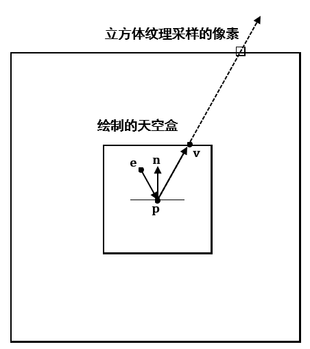

# 前言

> **注意：这一章对应项目代码2.x.x版本，持有低版本项目代码的同学请到Github更新一份**

这一章我们主要学习由6个纹理所构成的纹理立方体贴图，以及用它来实现一个静态天空盒。

在此之前还需要回顾一下里面有关纹理子资源的部分：

| 章节回顾                                                     |
| ------------------------------------------------------------ |
| [深入理解与使用2D纹理资源(重点了解纹理子资源、纹理数组和纹理立方体)](misc/Texture2D.md) |

# 立方体映射(Cube Mapping)

一个立方体（通常是正方体）包含六个面，对于立方体映射来说，它的六个面对应的是六张纹理贴图，然后以该立方体建系，中心为原点，且三个坐标轴是轴对齐的。我们可以使用方向向量(±X,±Y,±Z)，从原点开始，发射一条射线(取方向向量的方向)来与某个面产生交点，取得该纹理交点对应的颜色。

> 注意：
>
> 1. 方向向量的大小并不重要，只要方向一致，那么不管长度是多少，最终选择的纹理和取样的像素都是一致的。
> 2. 使用方向向量时要确保所处的坐标系和立方体映射所处的坐标系一致，如方向向量和立方体映射同时处在世界坐标系中。


Direct3D提供了枚举类型`D3D11_TEXTURECUBE_FACE`来标识立方体某一表面：

```cpp
typedef enum D3D11_TEXTURECUBE_FACE {
	D3D11_TEXTURECUBE_FACE_POSITIVE_X = 0,
	D3D11_TEXTURECUBE_FACE_NEGATIVE_X = 1,
	D3D11_TEXTURECUBE_FACE_POSITIVE_Y = 2,
	D3D11_TEXTURECUBE_FACE_NEGATIVE_Y = 3,
	D3D11_TEXTURECUBE_FACE_POSITIVE_Z = 4,
	D3D11_TEXTURECUBE_FACE_NEGATIVE_Z = 5
} D3D11_TEXTURECUBE_FACE;
```

可以看出:

1. 索引0指向+X表面;
2. 索引1指向-X表面;
3. 索引2指向+Y表面;
4. 索引3指向-Y表面;
5. 索引4指向+Z表面;
6. 索引5指向-Z表面;

使用立方体映射意味着我们需要使用3D纹理坐标进行寻址。

在HLSL中，立方体纹理用`TextureCube`来表示。

# 环境贴图(Environment Maps)

关于立方体映射，应用最广泛的就是**环境贴图**了。为了获取一份环境贴图，我们可以将摄像机绑定到一个物体的中心(或者摄像机本身视为一个物体)，然后使用90°的垂直FOV和水平FOV(即宽高比1:1)，再让摄像机朝着±X轴、±Y轴、±Z轴共6个轴的方向各拍摄一张不包括物体本身的场景照片。因为FOV的角度为90°，这六张图片已经包含了以物体中心进行的透视投影，所记录的完整的周遭环境。接下来就是将这六张图片保存在立方体纹理中，以构成环境贴图。综上所述，环境映射就是在立方体表面的纹理中存储了周围环境的图像。

由于环境贴图仅捕获了远景的信息，这样附近的许多物体都可以共用同一个环境贴图。这种做法称之为**静态立方体贴图**，它的优点是仅需要六张纹理就可以轻松实现，但缺陷是该环境贴图并不会记录临近物体信息，在绘制反射时就看不到周围的物体了。

注意到环境贴图所使用的六张图片不一定非得是从Direct3D程序中捕获的。因为立方体映射仅存储纹理数据，它们的内容通常可以是美术师预先生成的，或者是自己找到的。

一般来说，我们能找到的天空盒有如下几种：

1. 已经创建好的.dds文件，可以直接通过`DDSTextureLoader`读取使用
2. 6张天空盒的正方形贴图，格式不限。（暂不考虑只有5张的）
3. 等距圆柱投影表示的2D展开图像。与前面两种的实现不同

若我们将纹理立方体展开，会是这个样子：


## 方法1：使用DXTex构建dds纹理立方体

准备6张天空盒的正方形贴图，打开放在[Github项目](https://github.com/MKXJun/DirectX11-With-Windows-SDK)中Utility文件夹内的DxTex.exe，新建纹理：


`Texture Type`要选择`Cubemap Texture`

`Dimensions`填写正方形纹理的像素宽度和高度

如果你需要自动生成mipmaps，则指定mipmap Level为1.如果你需要手工填充mipmaps，由于1024x1024的纹理mipmap最大数目为11，你可以指定mipmap Level为2-11的值。

对于`Surface/Volume Format`，通常情况下使用`Unsigned 32-bit: A8R8G8B8`格式，如果想要节省内存(但是会牺牲质量)，可以选用`Four CC 4-bit: DXT1`格式，可以获得6:1甚至8:1的压缩比。

创建好后会变成这样：


可以看到当前默认的是+X纹理。

接下来就是将这六张图片塞进该立方体纹理中了，选择View-Cube map Face，并选择需要修改的纹理：


在当前项目的Texture文件夹内已经准备好了有6张贴图。


选择File-Open To This Cubemap Face来选择对应的贴图以加载进来即可。每完成当前的面就要切换到下一个面继续操作，直到六个面都填充完毕。此时填充的是Mipmap Level为0的子资源：


如果你需要自动生成纹理，则可以点击下面的选项生成，要求创建时MipMap Level为1：


最后就可以点击File-Save As来保存dds文件了。

这种做法需要比较长的前期准备时间，它不适合批量处理。但是在读取上是最方便的。


## 方法2：使用代码读取天空盒

对于创建好的DDS立方体纹理，我们只需要使用`DDSTextureLoader`就可以很方便地读取进来：

```cpp
HR(CreateDDSTextureFromFile(
	device.Get(), 
	cubemapFilename.c_str(), 
	nullptr, 
	textureCubeSRV.GetAddressOf()));
```

然而从网络上能够下到的天空盒资源经常要么是一张天空盒贴图，要么是六张天空盒的正方形贴图，用DXTex导入还是比较麻烦的一件事情。我们也可以自己编写代码来构造立方体贴图。

将一张天空盒贴图转化成立方体纹理需要经历以下4个步骤：

1. 读取6张图片数据到CPU，或者创建GPU资源
2. 创建包含6个纹理的数组
3. 每个图片拷贝到纹理数组的对应位置（`UpdateSubresource`或`CopySubresourceRegion`）
4. 创建立方体纹理的SRV

具体代码如下：

```cpp
ComPtr<ID3D11Texture2D> pTex;
D3D11_TEXTURE2D_DESC texDesc;
std::string filenameStr;
std::vector<ID3D11ShaderResourceView*> pCubeTextures;
std::unique_ptr<TextureCube> pTexCube;
// Daylight
{
    filenameStr = "..\\Texture\\daylight0.png";
    for (size_t i = 0; i < 6; ++i)
    {
        filenameStr[19] = '0' + (char)i;
        pCubeTextures.push_back(m_TextureManager.CreateTexture(filenameStr));
    }

    pCubeTextures[0]->GetResource(reinterpret_cast<ID3D11Resource**>(pTex.ReleaseAndGetAddressOf()));
    pTex->GetDesc(&texDesc);
    pTexCube = std::make_unique<TextureCube>(m_pd3dDevice.Get(), texDesc.Width, texDesc.Height, DXGI_FORMAT_R8G8B8A8_UNORM_SRGB);
    for (uint32_t i = 0; i < 6; ++i)
    {
        pCubeTextures[i]->GetResource(reinterpret_cast<ID3D11Resource**>(pTex.ReleaseAndGetAddressOf()));
        m_pd3dImmediateContext->CopySubresourceRegion(pTexCube->GetTexture(), 
            D3D11CalcSubresource(0, i, 1), 0, 0, 0, pTex.Get(), 0, nullptr);
    }
    m_TextureManager.AddTexture("Daylight", pTexCube->GetShaderResource());
}
```

`TextureManager::CreateTexture`可以创建出GPU纹理资源，然后复制过去就行了。在创建了纹理立方体后，我们可以绑定到新创建的立方体模型上：

```cpp
// 天空盒立方体
Model* pModel = m_ModelManager.CreateFromGeometry("Skybox", Geometry::CreateBox());
pModel->materials[0].Set<std::string>("$Skybox", "Daylight");
m_Skybox.SetModel(pModel);
```

在`SkyboxEffect`里定义了`$Skybox`建立和着色器中纹理立方体的对应关系。现在我们将`$Skybox`映射为`TextureManager`中的`Daylight`纹理，后面在绘制的时候`SkyboxEffect`就会去查找该纹理并绑定到管线上。

`SkyboxEffect`的代码比较简单，读者可以自行阅读源码部分。

# 绘制天空盒

天空盒的绘制我们需要使用立方体或球体模型，目前我们使用的是立方体模型。 通过方向向量来映射到立方体纹理对应的像素颜色，同时它也指向当前绘制的立方体或球面上对应点。另外，为了保证绘制的天空盒永远处在摄像机能看到的最远处，通常会将该模型的中心设置在摄像机所处的位置。这样无论摄像机如何移动，天空盒也跟随摄像机移动，用户将永远到不了天空盒的一端。当然更好的做法是**强行抹除掉摄像机和模型的平移分量来进行变换和绘制**，以避免可能出现的天空盒抖动问题。可以说这和公告板一样，都是一种欺骗人眼的小技巧。

绘制天空盒需要以下准备工作：

1. 将天空盒载入HLSL的TextureCube中
2. 在光栅化阶段关闭背面消隐(正面是立方体向外的面，但摄像机在内部)
3. 在输出合并阶段的深度/模板状态，设置深度比较函数为小于等于，以允许深度值为1的像素绘制

## 新的深度/模板状态

在`RenderStates.h`引进了一个新的`ID3D11DepthStencilState`类型的成员`DSSLessEqual`，定义如下：

```cpp
D3D11_DEPTH_STENCIL_DESC dsDesc;

// 允许使用深度值一致的像素进行替换的深度/模板状态
// 该状态用于绘制天空盒，因为深度值为1.0时默认无法通过深度测试
dsDesc.DepthEnable = true;
dsDesc.DepthWriteMask = D3D11_DEPTH_WRITE_MASK_ALL;
dsDesc.DepthFunc = D3D11_COMPARISON_LESS_EQUAL;

dsDesc.StencilEnable = false;

HR(device->CreateDepthStencilState(&dsDesc, DSSLessEqual.GetAddressOf()));
```

然后我们在`EffectPass`里面提前设置好所需的状态即可：

```cpp
auto pPass = pImpl->m_pEffectHelper->GetEffectPass("Skybox");
pPass->SetRasterizerState(RenderStates::RSNoCull.Get());
pPass->SetDepthStencilState(RenderStates::DSSLessEqual.Get(), 0);
```

## HLSL代码

现在我们需要一组新的特效来绘制天空盒，其中与之相关的是`Sky.hlsli`, `Sky_VS.hlsl`和`Sky_PS.hlsl`，当然在C++那边还有新的`SkyEffect`类来管理，需要了解自定义Effect的可以回看第13章。

```hlsl
// Sky.hlsli
TextureCube g_TexCube : register(t0);
SamplerState g_Sam : register(s0);

cbuffer CBChangesEveryFrame : register(b0)
{
    matrix g_WorldViewProj;
}

struct VertexPos
{
    float3 PosL : POSITION;
};

struct VertexPosHL
{
    float4 PosH : SV_POSITION;
    float3 PosL : POSITION;
};


```

```hlsl
// Sky_VS.hlsl
#include "Sky.hlsli"

VertexPosHL VS(VertexPos vIn)
{
    VertexPosHL vOut;
    
    // 设置z = w使得z/w = 1(天空盒保持在远平面)
    float4 posH = mul(float4(vIn.PosL, 1.0f), g_WorldViewProj);
    vOut.PosH = posH.xyww;
    vOut.PosL = vIn.PosL;
    return vOut;
}
```

```hlsl
// Sky_PS.hlsl
#include "Sky.hlsli"

float4 PS(VertexPosHL pIn) : SV_Target
{
    return g_TexCube.Sample(g_Sam, pIn.PosL);
}

```

> 注意: 在过去，应用程序首先绘制天空盒以取代渲染目标和深度/模板缓冲区的清空。然而“ATI Radeon HD 2000 Programming Gudie"(现在已经404了)建议我们不要这么做。首先，为了获得内部硬件深度优化的良好表现，深度/模板缓冲区需要被显式清空。这对渲染目标同样有效。其次，通常绝大多数的天空会被其它物体给遮挡。因此，如果我们先绘制天空，再绘制物体的话会导致二次绘制，还不如先绘制物体，然后让被遮挡的天空部分不通过深度测试。因此现在推荐的做法为：总是先清空渲染目标和深度/模板缓冲区，天空盒的绘制留到最后。

# 模型的反射

关于环境映射，另一个主要应用就是模型表面的反射（只有当天空盒记录了除当前反射物体外的其它物体时，才能在该物体看到其余物体的反射）。对于静态天空盒来说，通过模型看到的反射只能看到天空盒本身，因此还是显得不够真实。至于动态天空盒就还是留到下一章再讲。

下图说明了反射是如何通过环境映射运作的。法向量`n`对应的表面就像是一个镜面，摄像机在位置`e`，观察点`p`时可以看到经过反射得到的向量`v`所指向的天空盒纹理的采样像素点：



首先在之前的`Basic.hlsli`中加入`TextureCube`:

```hlsl
// Basic.hlsli
Texture2D g_DiffuseMap : register(t0);
TextureCube g_TexCube : register(t1);
SamplerState g_Sam : register(s0);

// ...
```

然后只需要在`Basic_PS.hlsl`添加如下内容：

```hlsl
float4 litColor = texColor * (ambient + diffuse) + spec;

if (g_ReflectionEnabled)
{
    float3 incident = -toEyeW;
    float3 reflectionVector = reflect(incident, pIn.NormalW);
    float4 reflectionColor = g_TexCube.Sample(g_Sam, reflectionVector);

    litColor += g_Material.Reflect * reflectionColor;
}
    
litColor.a = texColor.a * g_Material.Diffuse.a;
return litColor;


```

在C++端，将采样器设置为各向异性过滤以获取更好的绘制效果：

```cpp
// 在RenderStates.h/.cpp可以看到
ComPtr<ID3D11SamplerState> RenderStates::SSAnistropicWrap;

D3D11_SAMPLER_DESC sampDesc;
ZeroMemory(&sampDesc, sizeof(sampDesc));

// 各向异性过滤模式
sampDesc.Filter = D3D11_FILTER_ANISOTROPIC;
sampDesc.AddressU = D3D11_TEXTURE_ADDRESS_WRAP;
sampDesc.AddressV = D3D11_TEXTURE_ADDRESS_WRAP;
sampDesc.AddressW = D3D11_TEXTURE_ADDRESS_WRAP;
sampDesc.ComparisonFunc = D3D11_COMPARISON_NEVER;
sampDesc.MaxAnisotropy = 4;
sampDesc.MinLOD = 0;
sampDesc.MaxLOD = D3D11_FLOAT32_MAX;
HR(device->CreateSamplerState(&sampDesc, SSAnistropicWrap.GetAddressOf()));


// 在BasicEffect.cpp可以看到
deviceContext->PSSetSamplers(0, 1, RenderStates::SSAnistropicWrap.GetAddressOf());

```


通常一个像素的颜色不完全是反射后的颜色（只有镜面才是100%反射）。因此，我们将原来的光照等式加上了材质反射的分量。当初`Material`的`Reflect`成员现在就派上了用场：

```cpp
// 物体表面材质
struct Material
{
	Material() { memset(this, 0, sizeof(Material)); }

	DirectX::XMFLOAT4 Ambient;
	DirectX::XMFLOAT4 Diffuse;
	DirectX::XMFLOAT4 Specular; // w = 镜面反射强度
	DirectX::XMFLOAT4 Reflect;
};

```

我们可以指定该材质的反射颜色，如果该材质只反射完整的红光部分，则在C++指定`Reflect = XMFLOAT4(1.0f, 0.0f, 0.0f, 0.0f)`。

使用带加法的反射容易引发一个问题：过度饱和。两个颜色的相加可能会存在RGB值超过1而变白，这会导致某些像素的颜色过于明亮。通常如果我们添加反射分量的颜色，就必须减小材质本身的环境分量和漫反射分量来实现平衡。另一种方式就是对反射分量和像素颜色`s`进行插值处理：

$$\mathbf{f} = t\mathbf{c}_{R} + (1 - t)\mathbf{s} (0 <= t <= 1) $$

这样我们就可以通过调整系数`t`来控制反射程度，以达到自己想要的效果。

还有一个问题就是，在平面上进行环境映射并不会取得理想的效果。这是因为上面的HLSL代码关于反射的部分只使用了方向向量来进行采样，这会导致以相同的的倾斜角度看平面时，不同的位置看到的反射效果却是一模一样的。正确的效果应该是：摄像机在跟随平面镜做平移运动时，平面镜的映象应该保持不动。下面用两张图来说明这个问题：


这里给出龙书所提供相关论文，用以纠正环境映射出现的问题： [Brennan02](http://developer.amd.com/wordpress/media/2012/10/ShaderX_CubeEnvironmentMapCorrection.pdf)

本项目现在不考虑解决这个问题。

# 项目演示

说了那么多内容，是时候看一些动图了吧。虽然现在项目换了ImGui，但考虑到GIF大小限制，还是用回原来的动图

该项目加载了三种类型的天空盒，可以随时切换。


